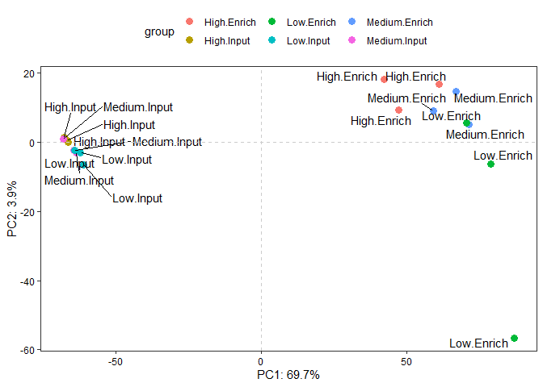
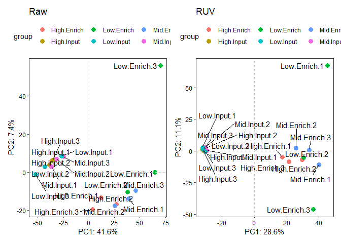

<!-- README.md is generated from README.Rmd. Please edit that file -->

# enRUVseq

<!-- badges: start -->
<!-- badges: end -->

The goal of `enRUVseq` is to perform normalization on RNA-seq including
enrichment (NAD-RNA-seq) using spike-in.

The main functions for normalizing enrichment variation between samples
were inspired by [RUVSeq](https://github.com/drisso/RUVSeq).

## Installation

You can install the development version from[GitHub](https://github.com/) with:

``` r
# install.packages("devtools")
devtools::install_github("thereallda/enRUVseq")
```

## Spike-in \> Non-spike-in (enRUVg)

If the spike-in is the predominant composition of the library, e.g., input RNA with 45ug spike-in and 5ug non-spike-in, uses `enRUVg`.

### Workflow of `enRUVseq`

``` r
library(enRUVseq)
library(tidyverse)
#> -- Attaching packages --------------------------------------- tidyverse 1.3.0 --
#> v ggplot2 3.3.5     v purrr   0.3.4
#> v tibble  3.0.4     v dplyr   1.0.2
#> v tidyr   1.1.2     v stringr 1.4.0
#> v readr   1.4.0     v forcats 0.5.0
#> Warning: package 'ggplot2' was built under R version 4.0.5
#> -- Conflicts ------------------------------------------ tidyverse_conflicts() --
#> x dplyr::filter() masks stats::filter()
#> x dplyr::lag()    masks stats::lag()
library(edgeR)
#> Loading required package: limma
# load data
load('data/deg.enruvg.rda')

deg.enruvg
#> An object of class "DGEList"
#> $counts
#>                 G1 G2 G3 G4 G5 G6 G7 G8 G9 G10 G11 G12 G13 G14 G15 G16 G17 G18
#> ENSG00000223972  0  0  0  0  0  1  0  0  0   0   0   1   0   2   0   0   0   0
#> ENSG00000227232  6 14  3  5  6  3  8  4 11  11   3   2   7   6   1   4   2   1
#> ENSG00000278267  1  0  0  0  1  0  0  0  0   1   0   0   0   0   0   0   0   0
#> ENSG00000243485  0  0  0  0  0  0  0  0  0   0   0   0   0   0   0   0   0   0
#> ENSG00000284332  0  0  0  0  0  0  0  0  0   0   0   0   0   0   0   0   0   0
#> 76283 more rows ...
#> 
#> $samples
#>           group lib.size norm.factors
#> G1   High.Input 10167659            1
#> G2   High.Input 10697821            1
#> G3   High.Input 10569925            1
#> G4 Medium.Input 11586753            1
#> G5 Medium.Input  9862067            1
#> 13 more rows ...
```

### Filtering low-expressed genes

``` r
keep <- filterByExpr(deg.enruvg, group = deg.enruvg$samples$group)
deg.enruvg <- deg.enruvg[keep,]
```

### Calculating size factors

``` r
# prefix of spike-in
spike_in_prefix <- '^FB'

# calculating RLE size factor based on spike-in
size_factors <- calcSizeFactors(deg.enruvg$counts, method = 'RLE', control.prefix = spike_in_prefix)
size_factors
#>        G1        G2        G3        G4        G5        G6        G7        G8 
#> 1.1693547 1.1642728 1.1675667 1.1429010 1.1260012 1.1366497 1.1433054 1.1664131 
#>        G9       G10       G11       G12       G13       G14       G15       G16 
#> 1.1723011 0.9352831 0.8795674 0.9580869 0.8273461 0.8705023 0.8470257 0.8126059 
#>       G17       G18 
#> 0.8566616 0.8219194
```

### Estimate variation factors

Due to the first singular value (SV) in NAD-RNA-seq represent the difference between enrich and input libraries (see below PCA plot (equivalent to SVD)) which should not be removed, we estimated the variation factors after dropping the first SV.

``` r
ggPCA(deg.enruvg$counts, labels = deg.enruvg$samples$group, vst.norm = TRUE)
```



``` r
# construct spike-in DGEList
spike_in_id <- grep(spike_in_prefix, rownames(deg.enruvg))
deg.spike <- DGEList(deg.enruvg$counts[spike_in_id,], group = deg.enruvg$samples$group)
deg.spike$samples$norm.factors <- size_factors
counts_norm <- cpm(deg.spike, log = TRUE)
# estimate the first 3 SV
W.ls <- enRUVg(counts_norm, isLog = TRUE, k = 4, drop = 1, control.idx = rownames(counts_norm)) # k starts with 2
str(W.ls)
#> List of 2
#>  $ W               : num [1:18, 1:3] 0.0391 -0.0144 0.0474 -0.0395 -0.0359 ...
#>   ..- attr(*, "dimnames")=List of 2
#>   .. ..$ : NULL
#>   .. ..$ : chr [1:3] "W_1" "W_2" "W_3"
#>  $ normalizedCounts: num [1:13007, 1:18] 4.41 1.17 3.95 4.98 1.56 ...
#>   ..- attr(*, "dimnames")=List of 2
#>   .. ..$ : chr [1:13007] "FBgn0031208" "FBgn0267987" "FBgn0067779" "FBgn0031213" ...
#>   .. ..$ : chr [1:18] "G1" "G2" "G3" "G4" ...
```

### Perform DE analysis

Next, we perform differential analysis between enrich and input with
estimated variation factors using edgeR.

``` r
design.df <- data.frame(samples_group=deg.enruvg$samples$group, W.ls$W, row.names=colnames(deg.enruvg))
design.ruvg <- model.matrix(as.formula(paste("~0+",paste(colnames(design.df), collapse = '+'))), data=design.df)
design.ruvg
#>     samples_groupHigh.Input samples_groupMedium.Input samples_groupLow.Input
#> G1                        1                         0                      0
#> G2                        1                         0                      0
#> G3                        1                         0                      0
#> G4                        0                         1                      0
#> G5                        0                         1                      0
#> G6                        0                         1                      0
#> G7                        0                         0                      1
#> G8                        0                         0                      1
#> G9                        0                         0                      1
#> G10                       0                         0                      0
#> G11                       0                         0                      0
#> G12                       0                         0                      0
#> G13                       0                         0                      0
#> G14                       0                         0                      0
#> G15                       0                         0                      0
#> G16                       0                         0                      0
#> G17                       0                         0                      0
#> G18                       0                         0                      0
#>     samples_groupHigh.Enrich samples_groupMedium.Enrich samples_groupLow.Enrich
#> G1                         0                          0                       0
#> G2                         0                          0                       0
#> G3                         0                          0                       0
#> G4                         0                          0                       0
#> G5                         0                          0                       0
#> G6                         0                          0                       0
#> G7                         0                          0                       0
#> G8                         0                          0                       0
#> G9                         0                          0                       0
#> G10                        1                          0                       0
#> G11                        1                          0                       0
#> G12                        1                          0                       0
#> G13                        0                          1                       0
#> G14                        0                          1                       0
#> G15                        0                          1                       0
#> G16                        0                          0                       1
#> G17                        0                          0                       1
#> G18                        0                          0                       1
#>              W_1         W_2          W_3
#> G1   0.039088880 -0.01225418  0.002374982
#> G2  -0.014432733  0.02415938 -0.026437472
#> G3   0.047428858 -0.05188606 -0.005670168
#> G4  -0.039478878  0.01023464 -0.038125066
#> G5  -0.035867865  0.08552911 -0.061391325
#> G6  -0.051881310  0.04641435 -0.024114692
#> G7  -0.148794745  0.02946245 -0.010148445
#> G8   0.002253820 -0.01641560  0.045949362
#> G9   0.001179007 -0.07308545  0.072204324
#> G10  0.121269204 -0.13375986  0.085267198
#> G11  0.264915867 -0.06943488  0.080221128
#> G12  0.435302317 -0.14102278  0.218821686
#> G13  0.275106633  0.06024254 -0.864961894
#> G14 -0.021316698 -0.05568706  0.024329613
#> G15  0.042704961  0.06277922  0.203865892
#> G16 -0.313731096  0.81891382  0.084850585
#> G17  0.107585489 -0.08474205  0.334795368
#> G18 -0.711331710 -0.49944760 -0.121831078
#> attr(,"assign")
#> [1] 1 1 1 1 1 1 2 3 4
#> attr(,"contrasts")
#> attr(,"contrasts")$samples_group
#> [1] "contr.treatment"
```

edgeR procedure

``` r
deg.enruvg$samples$norm.factors <- size_factors
# non-spike-in genes
deg.enruvg2 <- deg.enruvg[grep(spike_in_prefix, rownames(deg.enruvg), invert = TRUE), ]
deg.enruvg2 <- estimateDisp(deg.enruvg2, design = design.ruvg)
fit.glm <- glmFit(deg.enruvg2)
```

``` r
# make all contrast between enrich and input for each groups
ctrst <- unique(gsub("\\..*","",levels(deg.enruvg2$samples$group)))
ctrst.vec <- sapply(ctrst, function(i) {
  paste(paste0('samples_group', i, c(".Enrich", ".Input")), collapse = "-")
})
my.contrast <- makeContrasts(contrasts = ctrst.vec, levels = design.ruvg)
my.contrast
#>                             Contrasts
#> Levels                       samples_groupHigh.Enrich-samples_groupHigh.Input
#>   samples_groupHigh.Input                                                  -1
#>   samples_groupMedium.Input                                                 0
#>   samples_groupLow.Input                                                    0
#>   samples_groupHigh.Enrich                                                  1
#>   samples_groupMedium.Enrich                                                0
#>   samples_groupLow.Enrich                                                   0
#>   W_1                                                                       0
#>   W_2                                                                       0
#>   W_3                                                                       0
#>                             Contrasts
#> Levels                       samples_groupMedium.Enrich-samples_groupMedium.Input
#>   samples_groupHigh.Input                                                       0
#>   samples_groupMedium.Input                                                    -1
#>   samples_groupLow.Input                                                        0
#>   samples_groupHigh.Enrich                                                      0
#>   samples_groupMedium.Enrich                                                    1
#>   samples_groupLow.Enrich                                                       0
#>   W_1                                                                           0
#>   W_2                                                                           0
#>   W_3                                                                           0
#>                             Contrasts
#> Levels                       samples_groupLow.Enrich-samples_groupLow.Input
#>   samples_groupHigh.Input                                                 0
#>   samples_groupMedium.Input                                               0
#>   samples_groupLow.Input                                                 -1
#>   samples_groupHigh.Enrich                                                0
#>   samples_groupMedium.Enrich                                              0
#>   samples_groupLow.Enrich                                                 1
#>   W_1                                                                     0
#>   W_2                                                                     0
#>   W_3                                                                     0
```

``` r
lrt.ls <- apply(my.contrast, 2, function(x) glmLRT(fit.glm, contrast = x))
res.ls <- lapply(lrt.ls, topTags, n=Inf, adjust.method='BH')
# cut-off for NAD-RNA
res.sig.ls <- lapply(res.ls, function(x) subset(x$table, logFC > 1 & FDR < .05))
names(res.sig.ls) <- c("High", "Mid", "Low")
str(res.sig.ls)
#> List of 3
#>  $ High:'data.frame':    343 obs. of  5 variables:
#>   ..$ logFC : num [1:343] 2.47 2.47 3.32 2.28 2.4 ...
#>   ..$ logCPM: num [1:343] 11.58 7.73 4.62 6.64 5.36 ...
#>   ..$ LR    : num [1:343] 566 529 378 341 306 ...
#>   ..$ PValue: num [1:343] 3.83e-125 5.46e-117 2.89e-84 3.28e-76 1.93e-68 ...
#>   ..$ FDR   : num [1:343] 3.08e-121 2.19e-113 7.74e-81 6.58e-73 3.11e-65 ...
#>  $ Mid :'data.frame':    354 obs. of  5 variables:
#>   ..$ logFC : num [1:354] 2.56 2.56 2.45 3.37 2.58 ...
#>   ..$ logCPM: num [1:354] 11.58 7.73 6.64 4.62 5.62 ...
#>   ..$ LR    : num [1:354] 690 653 449 445 416 ...
#>   ..$ PValue: num [1:354] 3.76e-152 4.59e-144 1.03e-99 8.35e-99 1.96e-92 ...
#>   ..$ FDR   : num [1:354] 3.01e-148 1.84e-140 2.75e-96 1.68e-95 3.14e-89 ...
#>  $ Low :'data.frame':    315 obs. of  5 variables:
#>   ..$ logFC : num [1:315] 2.64 2.51 2.82 2.65 2.41 ...
#>   ..$ logCPM: num [1:315] 7.73 11.58 6.64 5.83 6.27 ...
#>   ..$ LR    : num [1:315] 641 620 552 432 409 ...
#>   ..$ PValue: num [1:315] 1.72e-141 7.49e-137 4.46e-122 6.41e-96 5.25e-91 ...
#>   ..$ FDR   : num [1:315] 1.38e-137 3.01e-133 1.19e-118 1.29e-92 8.43e-88 ...
```

### Visualization

``` r
fc_df <- reduceRes(res.sig.ls, fc.col = 'logFC')
BetweenStatPlot(fc_df, x='Group', y='logFC', color='Group') + ggtitle("Non-spike-in After Normalization")
```



## Spike-in \< Non-spike-in (enRUVs)

If the non-spike-in is the predominant composition of the library, e.g., input RNA with 5ug spike-in and 45ug non-spike-in, uses `enRUVs`.

### Workflow of `enRUVs`

The only difference between `enRUVg` and `enRUVs` is how the variation factors being estimated.

In `enRUVs` the variation factors are estimated as follows

``` r
scIdx <- matrix(data=c(1:3, 4:6), byrow=TRUE, nrow=2)
# > scIdx
#      [,1] [,2] [,3]
# [1,]    1    2    3
# [2,]    4    5    6
degs <- DGEList(counts_spike, group=samples_group)
degs$samples$norm.factors <- size_factors
counts_norm <- cpm(degs, log = T)
W.ls <- enRUVs(counts_norm, isLog = T, 
               k=i, 
               control.idx = grep(spike_in_prefix, rownames(counts_norm)),
               sc.idx = scIdx)
```

The estimated variation factors can be used in the edgeR procedure.

> <more details for enRUVs>
