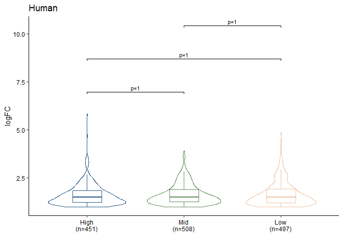
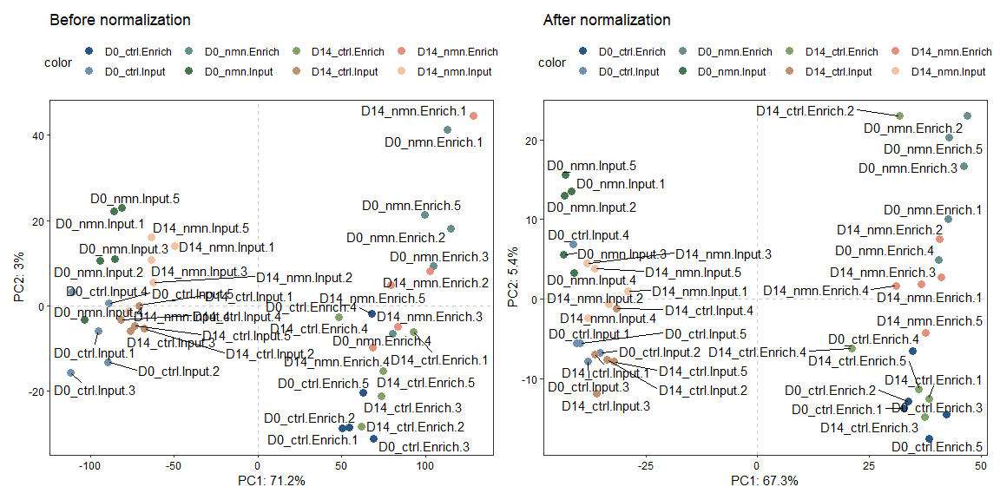

<!-- README.md is generated from README.Rmd. Please edit that file -->

# enRUVseq

<!-- badges: start -->
<!-- badges: end -->

The goal of `enRUVseq` is to perform normalization on RNA-seq including
enrichment (NAD-RNA-seq) using spike-in.

The main functions for normalizing enrichment variation between samples
were inspired by [RUVSeq](https://github.com/drisso/RUVSeq).

## Installation

You can install the development version of enRUVseq from
[GitHub](https://github.com/) with:

``` r
# install.packages("devtools")
devtools::install_github("thereallda/enRUVseq")
```

## Workflow

``` r
library(enRUVseq)
library(tidyverse)
library(edgeR)
library(paintingr)
library(patchwork)
library(SummarizedExperiment)
```

### Load data

Metadata including sample information.

``` r
meta <- read.csv('data-raw/metadata.csv', comment.char = '#')
meta
#>     id   condition replicate
#> 1   G1  High.Input         1
#> 2   G2  High.Input         2
#> 3   G3  High.Input         3
#> 4   G4   Mid.Input         1
#> 5   G5   Mid.Input         2
#> 6   G6   Mid.Input         3
#> 7   G7   Low.Input         1
#> 8   G8   Low.Input         2
#> 9   G9   Low.Input         3
#> 10 G10 High.Enrich         1
#> 11 G11 High.Enrich         2
#> 12 G12 High.Enrich         3
#> 13 G13  Mid.Enrich         1
#> 14 G14  Mid.Enrich         2
#> 15 G15  Mid.Enrich         3
#> 16 G16  Low.Enrich         1
#> 17 G17  Low.Enrich         2
#> 18 G18  Low.Enrich         3
```

NAD-RNA-Sequencing data, with genes in rows and samples in columns.

``` r
counts.df <- read.csv('data-raw/Counts.csv', row.names = 1)
counts.df[1:3,]
#>                 G1 G2 G3 G4 G5 G6 G7 G8 G9 G10 G11 G12 G13 G14 G15 G16 G17 G18
#> ENSG00000223972  0  0  0  0  0  1  0  0  0   0   0   1   0   2   0   0   0   0
#> ENSG00000227232  6 14  3  5  6  3  8  4 11  11   3   2   7   6   1   4   2   1
#> ENSG00000278267  1  0  0  0  1  0  0  0  0   1   0   0   0   0   0   0   0   0
```

### Filtering low-expressed genes

``` r
keep <- filterByExpr(counts.df, group = meta$condition)
counts_keep <- counts.df[keep,]
dim(counts.df); dim(counts_keep)
#> [1] 76290    18
#> [1] 21035    18
```

### Create Enone object

Use “input.id” and “enrich.id” to specify the id of input and enrich
library, which should be the same as `group`. If `group` is
`c("High.Input", "High.Enrich",...)`, then `input.id` = ‘Input’ and
`enrich.id` = ‘Enrich’.

`synthetic.id` is a vector specify the ids of synthetic RNA, if
included.

``` r
# set-up
enrich_group <- gsub(".*\\.", "", meta$condition)
spikeInPrefix <- '^FB'
# create Enone
Enone <- createEnone(data = counts_keep,
                     bio.group = meta$condition,
                     enrich.group = enrich_group,
                     batch.group = NULL,
                     spike.in.prefix = spikeInPrefix,
                     synthetic.id = c('Syn1','Syn2'),
                     input.id = "Input",
                     enrich.id = "Enrich"
                     )
Enone
#> class: Enone 
#> dim: 21035 18 
#> metadata(0):
#> assays(1): ''
#> rownames(21035): ENSG00000279457 ENSG00000248527 ... Syn1 Syn2
#> rowData names(3): GeneID SpikeIn Synthetic
#> colnames(18): G1 G2 ... G17 G18
#> colData names(5): id condition enrich replicate batch
```

Raw counts (sample + spike-in) can be accessed with

``` r
assay(Enone)[1:3,];dim(assay(Enone))
#>                  G1  G2  G3  G4 G5 G6 G7  G8  G9 G10 G11 G12 G13 G14 G15 G16
#> ENSG00000279457   9  16   9   6  9  8  7  17   8   1   1   9   2   6   6   7
#> ENSG00000248527 128 103 101 126 98 94 86 139 132 130 106 121 101 110 102  69
#> ENSG00000188976  45  58  40  35 45 42 27  49  38  29  22  20  32  28  35  19
#>                 G17 G18
#> ENSG00000279457   3   4
#> ENSG00000248527  71 102
#> ENSG00000188976  34   6
#> [1] 21035    18
```

Sample information is stored in `colData`

``` r
colData(Enone)
#> DataFrame with 18 rows and 5 columns
#>              id   condition      enrich replicate       batch
#>     <character> <character> <character> <numeric> <character>
#> G1           G1  High.Input       Input         1          NA
#> G2           G2  High.Input       Input         2          NA
#> G3           G3  High.Input       Input         3          NA
#> G4           G4   Mid.Input       Input         1          NA
#> G5           G5   Mid.Input       Input         2          NA
#> ...         ...         ...         ...       ...         ...
#> G14         G14  Mid.Enrich      Enrich         2          NA
#> G15         G15  Mid.Enrich      Enrich         3          NA
#> G16         G16  Low.Enrich      Enrich         1          NA
#> G17         G17  Low.Enrich      Enrich         2          NA
#> G18         G18  Low.Enrich      Enrich         3          NA
```

### Perform normalization and assessment

Normalization and assessment can be achieved by wrapper function `enONE`

``` r
Enone <- enONE(Enone, 
               ruv.norm = TRUE, ruv.k = 3,
               pam.krange = 2:6, pc.k = 3
               )
#> The number of negative control genes for RUV: 1000 
#> The number of positive evaluation genes: 1000 
#> The number of negative evaluation genes: 1000 
#> Apply normalization...
#> Perform assessment...
```

Selected gene sets are stored in `rowData`, including:

-   `NegControl`: Boolean value indicate whether this gene is a member
    of the negative control gene sets for RUV, default the most 1000 not
    enriched genes in spike_in are selected.
-   `NegEvaluation`: Boolean value indicate whether this gene is a
    member of the negative evaluation gene set, default the most 1000
    not variable genes in samples are selected.
-   `PosEvaluation`: Boolean value indicate whether this gene is a
    member of the positive evaluation gene set, default the most 1000
    variable genes in samples are selected.

``` r
rowData(Enone)
#> DataFrame with 21035 rows and 6 columns
#>                          GeneID   SpikeIn Synthetic NegControl NegEvaluation
#>                     <character> <logical> <logical>  <logical>     <logical>
#> ENSG00000279457 ENSG00000279457     FALSE     FALSE      FALSE         FALSE
#> ENSG00000248527 ENSG00000248527     FALSE     FALSE      FALSE         FALSE
#> ENSG00000188976 ENSG00000188976     FALSE     FALSE      FALSE         FALSE
#> ENSG00000187608 ENSG00000187608     FALSE     FALSE      FALSE         FALSE
#> ENSG00000131591 ENSG00000131591     FALSE     FALSE      FALSE          TRUE
#> ...                         ...       ...       ...        ...           ...
#> FBgn0013688         FBgn0013688      TRUE     FALSE      FALSE         FALSE
#> FBgn0085753         FBgn0085753      TRUE     FALSE      FALSE         FALSE
#> FBgn0267511         FBgn0267511      TRUE     FALSE      FALSE         FALSE
#> Syn1                       Syn1     FALSE      TRUE      FALSE         FALSE
#> Syn2                       Syn2     FALSE      TRUE      FALSE         FALSE
#>                 PosEvaluation
#>                     <logical>
#> ENSG00000279457         FALSE
#> ENSG00000248527         FALSE
#> ENSG00000188976         FALSE
#> ENSG00000187608         FALSE
#> ENSG00000131591         FALSE
#> ...                       ...
#> FBgn0013688             FALSE
#> FBgn0085753             FALSE
#> FBgn0267511             FALSE
#> Syn1                    FALSE
#> Syn2                    FALSE
```

Normalized counts are stored in `counts` slot in which `sample` slot
holds the counts from sample and `spike_in` slot for spike-in counts.

``` r
names(Enone@counts$sample)
#>  [1] "TC"             "UQ"             "TMM"            "DESeq"         
#>  [5] "Raw"            "TC_RUVg_k1"     "TC_RUVs_k1"     "TC_RUVse_k1"   
#>  [9] "TC_RUVg_k2"     "TC_RUVs_k2"     "TC_RUVse_k2"    "TC_RUVg_k3"    
#> [13] "TC_RUVs_k3"     "TC_RUVse_k3"    "UQ_RUVg_k1"     "UQ_RUVs_k1"    
#> [17] "UQ_RUVse_k1"    "UQ_RUVg_k2"     "UQ_RUVs_k2"     "UQ_RUVse_k2"   
#> [21] "UQ_RUVg_k3"     "UQ_RUVs_k3"     "UQ_RUVse_k3"    "TMM_RUVg_k1"   
#> [25] "TMM_RUVs_k1"    "TMM_RUVse_k1"   "TMM_RUVg_k2"    "TMM_RUVs_k2"   
#> [29] "TMM_RUVse_k2"   "TMM_RUVg_k3"    "TMM_RUVs_k3"    "TMM_RUVse_k3"  
#> [33] "DESeq_RUVg_k1"  "DESeq_RUVs_k1"  "DESeq_RUVse_k1" "DESeq_RUVg_k2" 
#> [37] "DESeq_RUVs_k2"  "DESeq_RUVse_k2" "DESeq_RUVg_k3"  "DESeq_RUVs_k3" 
#> [41] "DESeq_RUVse_k3" "Raw_RUVg_k1"    "Raw_RUVs_k1"    "Raw_RUVse_k1"  
#> [45] "Raw_RUVg_k2"    "Raw_RUVs_k2"    "Raw_RUVse_k2"   "Raw_RUVg_k3"   
#> [49] "Raw_RUVs_k3"    "Raw_RUVse_k3"
```

Counts matrix can be accessed by `Counts`

``` r
Counts(Enone, slot='sample', method='DESeq_RUVs_k2')[1:3,]
#>                        G1        G2        G3        G4        G5        G6
#> ENSG00000279457  20.05360  32.64876  20.41072  12.92968  20.39516  19.57442
#> ENSG00000248527 309.87592 237.47442 249.15939 287.58159 244.65846 245.32491
#> ENSG00000188976  54.35569  67.03569  47.44229  43.69717  55.88767  58.62215
#>                        G7        G8        G9        G10        G11       G12
#> ENSG00000279457  16.23018  34.95917  15.53614   3.681608   3.815088  23.08907
#> ENSG00000248527 221.05153 308.81695 264.88451 374.089811 341.708657 330.78894
#> ENSG00000188976  36.98311  53.79377  38.34926  42.985649  33.949598  26.28704
#>                        G13       G14       G15       G16       G17       G18
#> ENSG00000279457   7.035444  17.13606  20.63565  15.24133  14.34904  16.60026
#> ENSG00000248527 346.692276 334.43050 390.20670 304.37399 302.61404 303.65217
#> ENSG00000188976  53.156089  44.83261  59.48977  34.14039  34.84485  34.14900
```

Factors of normalization are stored in slot `enone_factor` in which
`sample` slot holds the factors of sample and `spike_in` slot for
spike-in.

``` r
names(Enone@enone_factor$sample)
#>  [1] "TC"             "UQ"             "TMM"            "DESeq"         
#>  [5] "Raw"            "TC_RUVg_k1"     "TC_RUVs_k1"     "TC_RUVse_k1"   
#>  [9] "TC_RUVg_k2"     "TC_RUVs_k2"     "TC_RUVse_k2"    "TC_RUVg_k3"    
#> [13] "TC_RUVs_k3"     "TC_RUVse_k3"    "UQ_RUVg_k1"     "UQ_RUVs_k1"    
#> [17] "UQ_RUVse_k1"    "UQ_RUVg_k2"     "UQ_RUVs_k2"     "UQ_RUVse_k2"   
#> [21] "UQ_RUVg_k3"     "UQ_RUVs_k3"     "UQ_RUVse_k3"    "TMM_RUVg_k1"   
#> [25] "TMM_RUVs_k1"    "TMM_RUVse_k1"   "TMM_RUVg_k2"    "TMM_RUVs_k2"   
#> [29] "TMM_RUVse_k2"   "TMM_RUVg_k3"    "TMM_RUVs_k3"    "TMM_RUVse_k3"  
#> [33] "DESeq_RUVg_k1"  "DESeq_RUVs_k1"  "DESeq_RUVse_k1" "DESeq_RUVg_k2" 
#> [37] "DESeq_RUVs_k2"  "DESeq_RUVse_k2" "DESeq_RUVg_k3"  "DESeq_RUVs_k3" 
#> [41] "DESeq_RUVse_k3" "Raw_RUVg_k1"    "Raw_RUVs_k1"    "Raw_RUVse_k1"  
#> [45] "Raw_RUVg_k2"    "Raw_RUVs_k2"    "Raw_RUVse_k2"   "Raw_RUVg_k3"   
#> [49] "Raw_RUVs_k3"    "Raw_RUVse_k3"
```

Factors can be accessed by `getFactor`

If RUV was not performed, return only `normFactor` for scaling.

``` r
getFactor(Enone, slot='sample', method='DESeq')
#> $normFactor
#>        G1        G2        G3        G4        G5        G6        G7        G8 
#> 1.0987616 1.1094701 1.1059071 1.0836057 1.0795164 1.0638930 1.0730029 1.1057959 
#>        G9       G10       G11       G12       G13       G14       G15       G16 
#> 1.1226781 0.9346160 0.9477768 0.9971364 0.9095979 0.9039245 0.8819820 0.8720644 
#>       G17       G18 
#> 0.9311630 0.8602471
```

Otherwise, return both `normFactor` and `adjustFacot`

``` r
getFactor(Enone, slot='sample', method='DESeq_RUVs_k2')
#> $adjustFactor
#>            W_1         W_2
#> G1   0.3601215 -0.30986777
#> G2   0.3708349 -0.28373197
#> G3   0.3730433 -0.33587508
#> G4   0.3318461 -0.24470871
#> G5   0.3702598 -0.29631193
#> G6   0.3199362 -0.28479507
#> G7   0.3631072 -0.23026700
#> G8   0.3394242 -0.35337124
#> G9   0.3315147 -0.34889009
#> G10  0.3236123 -0.33150210
#> G11  0.3938964 -0.31692965
#> G12  0.3561895 -0.37533084
#> G13  0.3740962 -0.32641666
#> G14  0.3331877 -0.28882605
#> G15  0.4200996 -0.35893120
#> G16  0.9505030  0.33914614
#> G17  0.4941176 -0.99669927
#> G18 -0.4386911  0.07008178
#> 
#> $normFactor
#>        G1        G2        G3        G4        G5        G6        G7        G8 
#> 1.0987616 1.1094701 1.1059071 1.0836057 1.0795164 1.0638930 1.0730029 1.1057959 
#>        G9       G10       G11       G12       G13       G14       G15       G16 
#> 1.1226781 0.9346160 0.9477768 0.9971364 0.9095979 0.9039245 0.8819820 0.8720644 
#>       G17       G18 
#> 0.9311630 0.8602471
```

Check the metrics of normalizations (ranked by scores in decreasing
order).

``` r
head(getMetrics(Enone))
#>                 BIO_SIL ASSAY_SIL BATCH_SIL   PAM_SIL      RLE_MED     RLE_IQR
#> DESeq_RUVs_k3 0.1948833 0.4906262         0 0.9004723 0.0003636082 0.005214805
#> TMM_RUVs_k3   0.1956830 0.4903941         0 0.9003602 0.0003898683 0.005242534
#> UQ_RUVs_k3    0.2110628 0.4873798         0 0.8911418 0.0025157267 0.004785187
#> TMM_RUVs_k2   0.1843384 0.4878088         0 0.7961745 0.0003427272 0.012296702
#> DESeq_RUVs_k2 0.1821786 0.4858159         0 0.7913705 0.0003187403 0.012366505
#> TC_RUVs_k3    0.2422452 0.4890688         0 0.8879811 0.0088929255 0.004189861
#>               EXP_WV_COR EXP_UV_COR
#> DESeq_RUVs_k3  0.8143870  0.2858042
#> TMM_RUVs_k3    0.8132071  0.2869781
#> UQ_RUVs_k3     0.7819716  0.3226025
#> TMM_RUVs_k2    0.6632039  0.3616030
#> DESeq_RUVs_k2  0.6755037  0.3586064
#> TC_RUVs_k3     0.8512730  0.5829169
```

Check the performance of normalizations (ranked by scores in decreasing
order). Higher score means better performance.

``` r
head(getScore(Enone))
#>               BIO_SIL ASSAY_SIL BATCH_SIL PAM_SIL RLE_MED RLE_IQR EXP_WV_COR
#> DESeq_RUVs_k3      47        27         1      50      37      45         45
#> TMM_RUVs_k3        48        26         1      49      34      44         44
#> UQ_RUVs_k3         49        22         1      48      14      46         39
#> TMM_RUVs_k2        46        24         1      45      39      34         16
#> DESeq_RUVs_k2      45        19         1      44      42      33         18
#> TC_RUVs_k3         50        25         1      47       8      47         47
#>               EXP_UV_COR    SCORE
#> DESeq_RUVs_k3         50 43.00000
#> TMM_RUVs_k3           49 42.00000
#> UQ_RUVs_k3            48 38.00000
#> TMM_RUVs_k2           44 35.42857
#> DESeq_RUVs_k2         45 35.14286
#> TC_RUVs_k3            18 34.57143
```

#### PCA biplot

if batch not provided, preclude `BATCH_SIL` column

``` r
pca.nsp.eval <- prcomp(Enone@enone_score[,-c(3, 9)], scale = TRUE)
ggPCA_Biplot(pca.nsp.eval, performance_score = Enone@enone_score$SCORE)
```



save

``` r
save(Enone, file='data/NormAssess.rda')
```

### The best performance

``` r
# select the best normalization
best.norm <- rownames(Enone@enone_score[1,])
best.norm.data <- Counts(Enone, slot = 'sample', method = best.norm)
best.norm.factors <- getFactor(Enone, slot = 'sample', method = best.norm)
best.norm
#> [1] "DESeq_RUVs_k3"
```

### Effect of normalization

we use PCA to visualize the counts from non-spike-in samples before and
after the normalization.

``` r
samples_name <- paste(meta$condition, meta$replicate, sep='.')
p1 <- ggPCA(log1p(Counts(Enone, slot='sample', 'Raw')), 
            group = meta$condition,
            label = samples_name, vst.norm = FALSE) + ggtitle('Before normalization')
p2 <- ggPCA(log1p(best.norm.data), 
            group = meta$condition,
            label = samples_name, vst.norm = FALSE) + ggtitle('After normalization')
p1 + p2
```



### FindEnrichment

You can find enriched genes by `FindEnrichment`.

Enriched genes are saved at slots `Enone@enrichment` (all) and
`Enone@enrichment_filtered` (filtered).

Default criteria for enriched genes is log2-Fold-Change
(enrichment/input) \>= 1 & adjusted p-value \< 0.05.

``` r
Enone <- FindEnrichment(Enone, slot='sample', method = best.norm, 
                        fc.cutoff = 1, p.cutoff = 0.05)
unlist(lapply(Enone@enrichment_filtered$sample, nrow))
#> High.Enrich_High.Input   Mid.Enrich_Mid.Input   Low.Enrich_Low.Input 
#>                    451                    508                    497
```

Each enrichment table is a `data.frame` with a list of genes as rows,
and associated information as columns (GeneID, logFC, p-values, etc.).
The following columns are present in the table:

-   `GeneID`: ID of genes.
-   `logFC`: log2 fold-change between enrichment and input samples.
    Positive values indicate that the gene is more highly enriched in
    the enrichment group.
-   `logCPM`: log2 CPM (counts per million) of the average expression of
    all samples.
-   `LR`: Likelihood ratio of the likelihood ratio test.
-   `PValue`: p-value from the likelihood ratio test.
-   `FDR`: False discovery rate of the p-value, default “BH” method is
    applied.

``` r
head(Enone@enrichment_filtered$sample$High.Enrich_High.Input)
#>            GeneID    logFC    logCPM       LR        PValue           FDR
#> 1 ENSG00000244734 2.504240 16.378929 836.4558 6.399167e-184 5.135971e-180
#> 2 ENSG00000227081 2.497956 12.539401 744.2740 7.054158e-164 2.830833e-160
#> 3 ENSG00000137970 2.513253 11.435113 549.5516 1.575948e-121 4.216187e-118
#> 4 ENSG00000143110 3.329794  9.414213 484.5926 2.139981e-107 4.293871e-104
#> 5 ENSG00000244398 2.218602 11.070572 460.1227 4.520646e-102  7.256541e-99
#> 6 ENSG00000113387 3.057590  9.120418 446.5336  4.097381e-99  5.480930e-96
```

Reduce list of enrichment and visualize with violin-box plot.

``` r
nad.sig.ls <- Enone@enrichment_filtered$sample
nad_df1 <- reduceRes(nad.sig.ls, fc.col = 'logFC')
nad_df1$Group <- gsub('\\..*', '', nad_df1$Group)
nad_df1$Group <- factor(nad_df1$Group, levels = unique(nad_df1$Group))
bxp1 <- BetweenStatPlot(nad_df1, x='Group', y='logFC', color='Group', step.increase = 0.6) + ggtitle('Human')
bxp1
```


