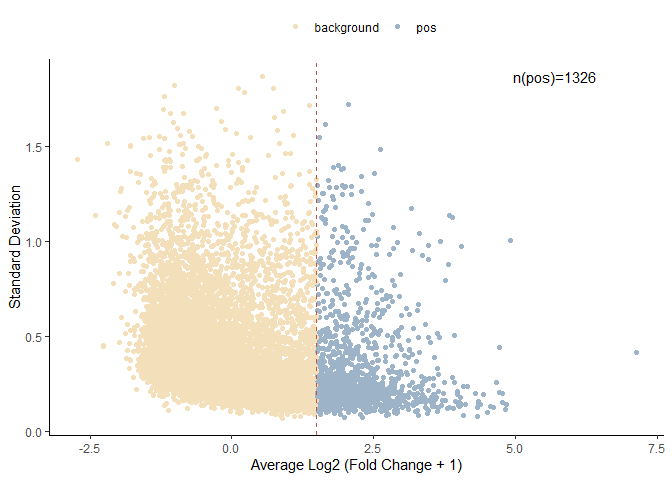
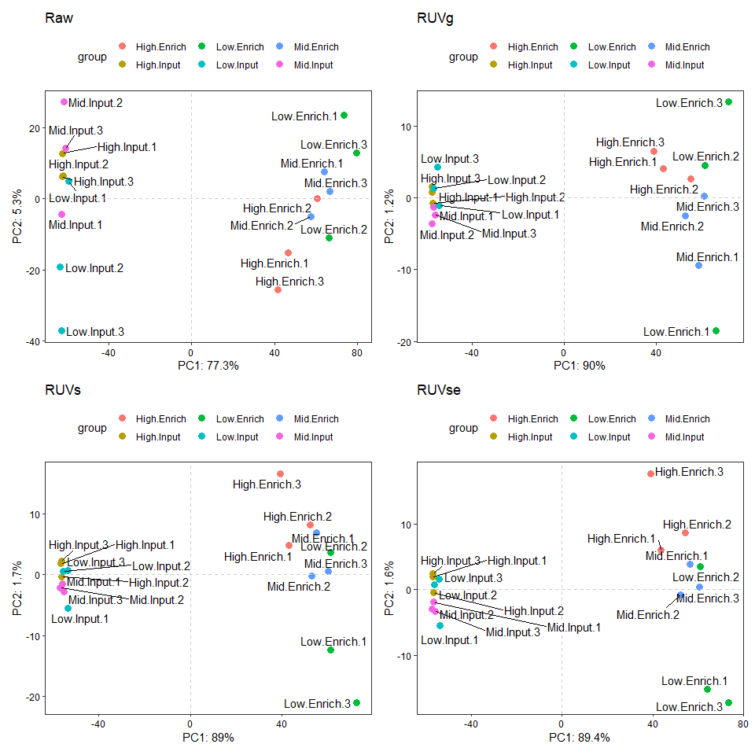
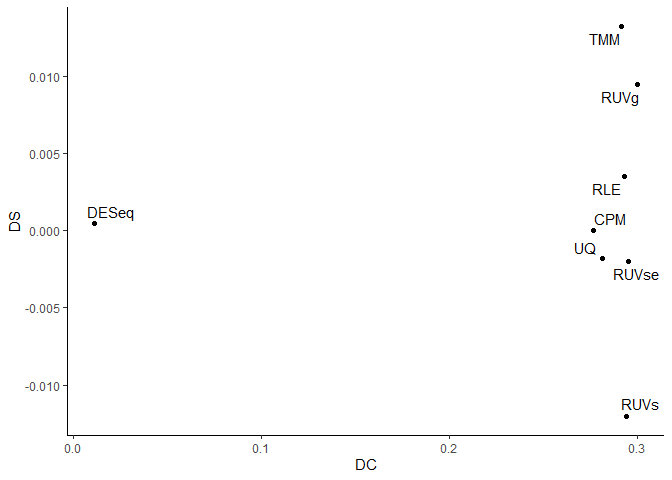
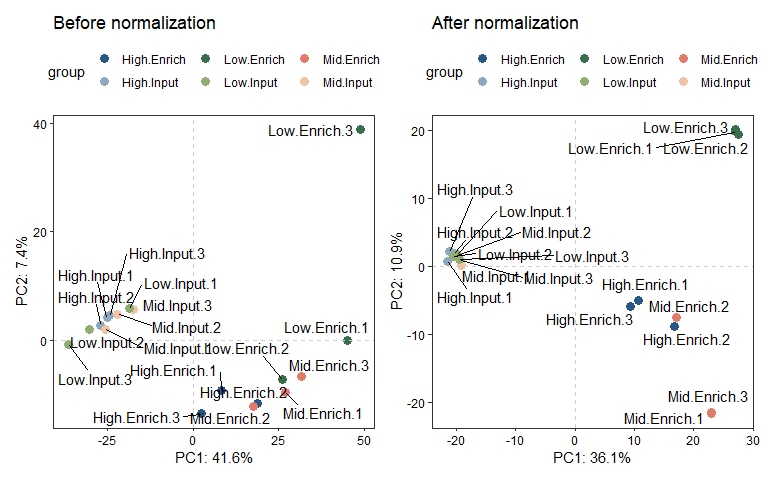
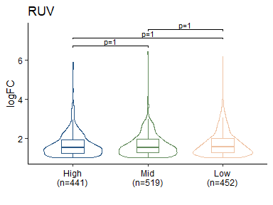
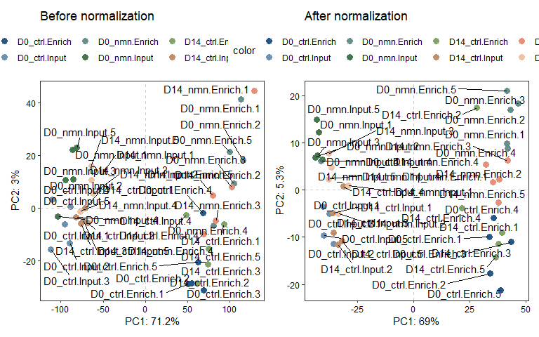

<!-- README.md is generated from README.Rmd. Please edit that file -->

# enRUVseq

<!-- badges: start -->
<!-- badges: end -->

The goal of `enRUVseq` is to perform normalization on RNA-seq including
enrichment (NAD-RNA-seq) using spike-in.

The main functions for normalizing enrichment variation between samples
were inspired by [RUVSeq](https://github.com/drisso/RUVSeq).

## Installation

You can install the development version of enRUVseq from
[GitHub](https://github.com/) with:

``` r
# install.packages("devtools")
devtools::install_github("thereallda/enRUVseq")
```

## Workflow

``` r
library(enRUVseq)
library(tidyverse)
library(edgeR)
library(paintingr)
library(patchwork)
```

### Load data

Metadata including sample information.

``` r
meta <- read.csv('data-raw/metadata_enRUVg.csv', comment.char = '#')
meta
#>     id   condition replicate
#> 1   G1  High.Input         1
#> 2   G2  High.Input         2
#> 3   G3  High.Input         3
#> 4   G4   Mid.Input         1
#> 5   G5   Mid.Input         2
#> 6   G6   Mid.Input         3
#> 7   G7   Low.Input         1
#> 8   G8   Low.Input         2
#> 9   G9   Low.Input         3
#> 10 G10 High.Enrich         1
#> 11 G11 High.Enrich         2
#> 12 G12 High.Enrich         3
#> 13 G13  Mid.Enrich         1
#> 14 G14  Mid.Enrich         2
#> 15 G15  Mid.Enrich         3
#> 16 G16  Low.Enrich         1
#> 17 G17  Low.Enrich         2
#> 18 G18  Low.Enrich         3
```

NAD-RNA-Sequencing data, with genes in rows and samples in columns.

``` r
counts.df <- read.csv('data-raw/Counts_enRUVg.csv', row.names = 1)
counts.df[1:3,]
#>                 G1 G2 G3 G4 G5 G6 G7 G8 G9 G10 G11 G12 G13 G14 G15 G16 G17 G18
#> ENSG00000223972  0  0  0  0  0  1  0  0  0   0   0   1   0   2   0   0   0   0
#> ENSG00000227232  6 14  3  5  6  3  8  4 11  11   3   2   7   6   1   4   2   1
#> ENSG00000278267  1  0  0  0  1  0  0  0  0   1   0   0   0   0   0   0   0   0
```

### Filtering low-expressed genes

``` r
keep <- filterByExpr(counts.df, group = meta$condition)
counts.keep <- counts.df[keep,]
dim(counts.df); dim(counts.keep)
#> [1] 76290    18
#> [1] 21035    18
```

``` r
# spike-in counts
spikeInPrefix <- '^FB'
counts.sp <- counts.keep[grep(spikeInPrefix, rownames(counts.keep)),]
control.idx <- grep(spikeInPrefix, rownames(counts.keep), value = T)
sc.idx <-  t(sapply(unique(meta$condition), function(i) grep(i, meta$condition)))
sc.idx
#>             [,1] [,2] [,3]
#> High.Input     1    2    3
#> Mid.Input      4    5    6
#> Low.Input      7    8    9
#> High.Enrich   10   11   12
#> Mid.Enrich    13   14   15
#> Low.Enrich    16   17   18
```

### Genes selection

Select shared enriched genes based on log-fold-change from raw counts.

``` r
enrich.idx <- matrix(c(grep('Input',meta$condition, ignore.case = TRUE), 
                       grep('Enrich',meta$condition, ignore.case = TRUE)), 
                     nrow = 2, byrow = TRUE)
lfc_raw <- log2(counts.sp[, enrich.idx[2,]] + 1) - log2(counts.sp[, enrich.idx[1,]] + 1)
lfc_raw_df <- data.frame(
  id = rownames(lfc_raw),
  avg = rowMeans(lfc_raw),
  sd = MatrixGenerics::rowSds(as.matrix(lfc_raw))
) %>% 
  mutate(set = if_else(avg > 1.5, 'pos', 'background'))

lfc_raw_df %>% 
  ggplot(aes(avg, sd, color=set)) + 
  geom_point() + 
  geom_vline(xintercept = 1.5, lty = 'dashed', color=paint_palette('Pearlgirl')[1]) +
  annotate('text', max(lfc_raw_df$avg)*0.8, max(lfc_raw_df$sd), 
           label = paste0("n(pos)=",sum(lfc_raw_df$set == 'pos'))) +
  theme_classic() +
  theme(legend.position = 'top') +
  scale_color_manual(values = paint_palette('Pearlgirl')[3:4]) +
  labs(x='Average Log2 (Fold Change + 1)', y='Standard Deviation', color='')
```



``` r
pos.set <- subset(lfc_raw_df, set == 'pos')$id
```

### Apply normalization on spike-in

``` r
# apply normalization ----
norm.ls <- ApplyNormalization(counts.sp, 
                              control.idx = control.idx, 
                              sc.idx = sc.idx, 
                              enrich.idx = enrich.idx)
```

### Differential analysis on spike-in

Default cutoff for significant enriched genes: log-fold-change \>= 1 &
FDR \< 0.05

``` r
# differential analysis ----
de.ls1 <- DiffAnalysis(counts.sp,
                       data.norm.ls = norm.ls,
                       group = meta$condition)
#> Warning in DESeqDataSet(se, design = design, ignoreRank): some variables in
#> design formula are characters, converting to factors
#> estimating size factors
#> estimating dispersions
#> gene-wise dispersion estimates
#> mean-dispersion relationship
#> final dispersion estimates
#> fitting model and testing
#> Warning in DESeqDataSet(se, design = design, ignoreRank): some variables in
#> design formula are characters, converting to factors
#> estimating size factors
#> estimating dispersions
#> gene-wise dispersion estimates
#> mean-dispersion relationship
#> final dispersion estimates
#> fitting model and testing
```

### Assessment of normalization

#### PCA of spike-in

``` r
samples_name <- paste(meta$condition, meta$replicate, sep='.')
p1 <- ggPCA(log2(counts.sp + 1), labels = samples_name, vst.norm = FALSE) + ggtitle('Raw')
p2 <- ggPCA(log2(norm.ls$RUVg$dataNorm + 1), labels = samples_name, vst.norm = FALSE) + ggtitle('RUVg')
p3 <- ggPCA(log2(norm.ls$RUVs$dataNorm + 1), labels = samples_name, vst.norm = FALSE) + ggtitle('RUVs')
p4 <- ggPCA(log2(norm.ls$RUVse$dataNorm + 1), labels = samples_name, vst.norm = FALSE) + ggtitle('RUVse')
ps1 <- p1 + p2 + p3 + p4
ps1
```



#### DC and DS

``` r
## DC
cor.ls <- lapply(norm.ls[-1], function(x) AssessNormalization(norm.ls$Raw$dataNorm, x$dataNorm, pos.set, enrich.idx))
## DS
sim.ls <- lapply(de.ls1, function(x) AssessDiffAnalysis(de.ls1$CPM$res.sig.ls, x$res.sig.ls))
```

``` r
data.frame(
  DS=unlist(sim.ls),
  DC=unlist(cor.ls),
  id=names(sim.ls)
) %>% 
  ggplot(aes(DC, DS)) +
  geom_point() +
  ggrepel::geom_text_repel(aes(label=id)) +
  theme_classic()
```



Perform normalization on non-spike-in

``` r
# normalization of non-spike-in
counts.nsp <- counts.keep[!rownames(counts.keep) %in% control.idx, ]
norm.nsp.ls <- ApplyNormalization(counts.nsp, method = c("CPM", "UQ", "TMM", "DESeq", "RLE"))
# RUV normalization
nsp.ruvg <- normRUV(counts.keep, 
                    control.idx = control.idx,
                    method = 'RUVg')
nsp.ruvs <- normRUV(counts.keep, 
                    control.idx = control.idx,
                    sc.idx = sc.idx,
                    method = 'RUVs')
nsp.ruvse <- normRUV(counts.keep, 
                     control.idx = control.idx,
                     sc.idx = enrich.idx,
                     method = 'RUVse')

norm.nsp.ls[["RUVg"]] <- nsp.ruvg
norm.nsp.ls[["RUVs"]] <- nsp.ruvs
norm.nsp.ls[["RUVse"]] <- nsp.ruvse
```

#### Synthetic RNA

-   Syn1: 5% NAD-RNA

-   Syn2: m7G-RNA

``` r
syn_fc <- SynFC(norm.nsp.ls, syn.id = c("Syn1", "Syn2"), enrich.idx)
syn_fc$groups <- factor(rep(unique(gsub('\\..*', '', meta$condition)), each=3), 
                        levels = unique(gsub('\\..*', '', meta$condition)))
dp1 <- ggDotPlot(syn_fc, 'groups', 'Syn1', fill='method') + ggtitle('Synthetic RNA 1')
dp2 <- ggDotPlot(syn_fc, 'groups', 'Syn2', fill='method') + ggtitle('Synthetic RNA 2')
dp1 + dp2 + plot_layout(guides = 'collect')
```



### Differential analysis on non-spike-in

Determine the best normalization method based on assessments of spike-in
normalization.

Here, `RUVg` is the optimal method.

``` r
contrast_df <- data.frame(
  Group1 = unique(grep("Enrich", meta$condition, value = TRUE, ignore.case = TRUE)),
  Group2 = unique(grep("Input", meta$condition, value = TRUE, ignore.case = TRUE))
  )

de.nsp.ruvg <- edgeRDE(counts = counts.nsp,
                       group = meta$condition,
                       contrast.df = contrast_df,
                       adjust.factors = norm.nsp.ls[['RUVg']]$adjustFactor) 

# reduce a list of DE tables into one data frame
df.nsp.ruvg <- reduceRes(de.nsp.ruvg$res.sig.ls, fc.col = 'logFC')
df.nsp.ruvg$Group <- gsub('\\..*', '', df.nsp.ruvg$Group)
df.nsp.ruvg$Group <- factor(df.nsp.ruvg$Group, levels = unique(df.nsp.ruvg$Group))

# visualization with box-volin plot
BetweenStatPlot(df.nsp.ruvg, x='Group', y='logFC', color='Group') + ggtitle('RUV')
```



## Quick Start

### Perform RUV normalization

Both RUVg, RUVs and RUVse return the following:

-   `dataNorm`: the normalized count matrix of shape n x p, where n is
    the number of samples and p is the number of features.

-   `adjustFactor`: the adjusting factor for removing unwanted variation
    (n x k).

-   `alpha`: the nuisance parameters (k x p).

-   RUVg

``` r
spikeInPrefix <- '^FB' # prefix of spike-in gene id
control.idx <- grep(spikeInPrefix, rownames(counts.keep), value = TRUE)
set.ruvg <- normRUV(counts.keep, 
                    control.idx = control.idx,
                    method = 'RUVg')
str(set.ruvg)
#> List of 3
#>  $ dataNorm    : num [1:21035, 1:18] 18.6 253.9 85.8 58.1 21.6 ...
#>   ..- attr(*, "dimnames")=List of 2
#>   .. ..$ : chr [1:21035] "ENSG00000279457" "ENSG00000248527" "ENSG00000188976" "ENSG00000187608" ...
#>   .. ..$ : chr [1:18] "G1" "G2" "G3" "G4" ...
#>  $ adjustFactor: num [1:18, 1] 0.05434 -0.00651 0.06469 -0.04485 -0.05526 ...
#>   ..- attr(*, "dimnames")=List of 2
#>   .. ..$ : NULL
#>   .. ..$ : chr "W_1"
#>  $ alpha       : num [1, 1:21035] -1.1671 -0.0928 0.9526 -0.3312 2.3956 ...
#>   ..- attr(*, "dimnames")=List of 2
#>   .. ..$ : chr "W_1"
#>   .. ..$ : chr [1:21035] "ENSG00000279457" "ENSG00000248527" "ENSG00000188976" "ENSG00000187608" ...
```

-   RUVs

When using `RUVs`, replicated samples needed to be specified with a
matrix `sc.idx`.

`sc.idx` A numeric matrix specifying the replicate samples for which to
compute the count differences used to estimate the factors of unwanted
variation.

``` r
spikeInPrefix <- '^FB' # prefix of spike-in gene id
control.idx <- grep(spikeInPrefix, rownames(counts.keep), value = TRUE)
sc.idx <-  t(sapply(unique(meta$condition), function(i) grep(i, meta$condition)))
sc.idx 
#>             [,1] [,2] [,3]
#> High.Input     1    2    3
#> Mid.Input      4    5    6
#> Low.Input      7    8    9
#> High.Enrich   10   11   12
#> Mid.Enrich    13   14   15
#> Low.Enrich    16   17   18
```

``` r
set.ruvs <- normRUV(counts.keep, 
                    control.idx = control.idx,
                    sc.idx = sc.idx,
                    method = 'RUVs')
str(set.ruvs)
#> List of 3
#>  $ dataNorm    : num [1:21035, 1:18] 11.3 214.6 137.9 70.6 22.4 ...
#>   ..- attr(*, "dimnames")=List of 2
#>   .. ..$ : chr [1:21035] "ENSG00000279457" "ENSG00000248527" "ENSG00000188976" "ENSG00000187608" ...
#>   .. ..$ : chr [1:18] "G1" "G2" "G3" "G4" ...
#>  $ adjustFactor: num [1:18, 1] -0.793 -0.827 -0.778 -0.832 -0.863 ...
#>   ..- attr(*, "dimnames")=List of 2
#>   .. ..$ : chr [1:18] "G1" "G2" "G3" "G4" ...
#>   .. ..$ : chr "W_1"
#>  $ alpha       : num [1, 1:21035] -0.7691 -0.2987 0.7903 0.3743 -0.0991 ...
#>   ..- attr(*, "dimnames")=List of 2
#>   .. ..$ : NULL
#>   .. ..$ : chr [1:21035] "ENSG00000279457" "ENSG00000248527" "ENSG00000188976" "ENSG00000187608" ...
```

### Differential analysis with edgeR

One can use `edgeR` to perform differential analysis with adjusting
factors estimated from RUV.

First, specifying the contrasts

``` r
contrast_df <- data.frame(
  Group1 = unique(grep("Enrich", meta$condition, value = TRUE, ignore.case = TRUE)),
  Group2 = unique(grep("Input", meta$condition, value = TRUE, ignore.case = TRUE))
  )
contrast_df
#>        Group1     Group2
#> 1 High.Enrich High.Input
#> 2  Mid.Enrich  Mid.Input
#> 3  Low.Enrich  Low.Input
```

Then, perform `edgeR` procedure with non-spike-in counts

``` r
counts.nsp <- counts.keep[!rownames(counts.keep) %in% control.idx, ]
de.nsp1 <- edgeRDE(counts.nsp, 
            group = meta$condition,
            contrast.df = contrast_df,
            adjust.factors = set.ruvg$adjustFactor) 

str(de.nsp1)
#> List of 3
#>  $ de.obj    :Formal class 'DGEList' [package "edgeR"] with 1 slot
#>   .. ..@ .Data:List of 11
#>   .. .. ..$ : int [1:8028, 1:18] 9 128 45 29 12 102 20 34 22 10 ...
#>   .. .. .. ..- attr(*, "dimnames")=List of 2
#>   .. .. .. .. ..$ : chr [1:8028] "ENSG00000279457" "ENSG00000248527" "ENSG00000188976" "ENSG00000187608" ...
#>   .. .. .. .. ..$ : chr [1:18] "G1" "G2" "G3" "G4" ...
#>   .. .. ..$ :'data.frame':   18 obs. of  3 variables:
#>   .. .. .. ..$ group       : Factor w/ 6 levels "High.Enrich",..: 2 2 2 6 6 6 4 4 4 1 ...
#>   .. .. .. ..$ lib.size    : num [1:18] 460402 478429 454057 483226 455204 ...
#>   .. .. .. ..$ norm.factors: num [1:18] 1.1 1.11 1.11 1.08 1.08 ...
#>   .. .. ..$ : num [1:18, 1:7] 0 0 0 0 0 0 0 0 0 1 ...
#>   .. .. .. ..- attr(*, "dimnames")=List of 2
#>   .. .. .. .. ..$ : chr [1:18] "G1" "G2" "G3" "G4" ...
#>   .. .. .. .. ..$ : chr [1:7] "conditionHigh.Enrich" "conditionHigh.Input" "conditionLow.Enrich" "conditionLow.Input" ...
#>   .. .. .. ..- attr(*, "assign")= int [1:7] 1 1 1 1 1 1 2
#>   .. .. .. ..- attr(*, "contrasts")=List of 1
#>   .. .. .. .. ..$ condition: chr "contr.treatment"
#>   .. .. ..$ : num 0.0265
#>   .. .. ..$ : num [1:8028] 0.1221 0.0118 0.0308 0.0294 0.1059 ...
#>   .. .. ..$ : num [1:8028] 0.125 0.0113 0.0313 0.0312 0.1464 ...
#>   .. .. ..$ : num [1:8028] 4.36 7.97 6.33 6.39 4.56 ...
#>   .. .. ..$ : chr "locfit"
#>   .. .. ..$ : num 63.9
#>   .. .. ..$ : num 5.81
#>   .. .. ..$ : num 0.309
#>  $ res.ls    :List of 3
#>   ..$ High.Enrich-High.Input:'data.frame':   8028 obs. of  6 variables:
#>   .. ..$ GeneID: chr [1:8028] "ENSG00000244734" "Syn1" "ENSG00000227081" "ENSG00000137970" ...
#>   .. ..$ logFC : num [1:8028] 2.62 5.6 2.6 2.45 3.47 ...
#>   .. ..$ logCPM: num [1:8028] 16.38 9.83 12.54 11.44 9.42 ...
#>   .. ..$ LR    : num [1:8028] 977 832 712 447 446 ...
#>   .. ..$ PValue: num [1:8028] 1.54e-214 5.95e-183 5.77e-157 3.68e-99 5.23e-99 ...
#>   .. ..$ FDR   : num [1:8028] 1.23e-210 2.39e-179 1.54e-153 7.39e-96 8.40e-96 ...
#>   ..$ Mid.Enrich-Mid.Input  :'data.frame':   8028 obs. of  6 variables:
#>   .. ..$ GeneID: chr [1:8028] "ENSG00000244734" "Syn1" "ENSG00000227081" "ENSG00000137970" ...
#>   .. ..$ logFC : num [1:8028] 2.76 6.43 2.8 2.68 2.48 ...
#>   .. ..$ logCPM: num [1:8028] 16.38 9.83 12.54 11.44 11.07 ...
#>   .. ..$ LR    : num [1:8028] 1180 1093 911 594 562 ...
#>   .. ..$ PValue: num [1:8028] 1.24e-258 1.29e-239 3.76e-200 4.17e-131 2.54e-124 ...
#>   .. ..$ FDR   : num [1:8028] 9.98e-255 5.19e-236 1.01e-196 8.36e-128 4.08e-121 ...
#>   ..$ Low.Enrich-Low.Input  :'data.frame':   8028 obs. of  6 variables:
#>   .. ..$ GeneID: chr [1:8028] "ENSG00000244734" "Syn1" "ENSG00000227081" "ENSG00000137970" ...
#>   .. ..$ logFC : num [1:8028] 2.73 6.17 2.85 3.01 2.59 ...
#>   .. ..$ logCPM: num [1:8028] 16.38 9.83 12.54 11.44 11.07 ...
#>   .. ..$ LR    : num [1:8028] 1087 1064 878 697 574 ...
#>   .. ..$ PValue: num [1:8028] 2.71e-238 2.54e-233 4.73e-193 1.46e-153 6.56e-127 ...
#>   .. ..$ FDR   : num [1:8028] 2.18e-234 1.02e-229 1.26e-189 2.92e-150 1.05e-123 ...
#>  $ res.sig.ls:List of 3
#>   ..$ High.Enrich-High.Input:'data.frame':   441 obs. of  6 variables:
#>   .. ..$ GeneID: chr [1:441] "ENSG00000244734" "Syn1" "ENSG00000227081" "ENSG00000137970" ...
#>   .. ..$ logFC : num [1:441] 2.62 5.6 2.6 2.45 3.47 ...
#>   .. ..$ logCPM: num [1:441] 16.38 9.83 12.54 11.44 9.42 ...
#>   .. ..$ LR    : num [1:441] 977 832 712 447 446 ...
#>   .. ..$ PValue: num [1:441] 1.54e-214 5.95e-183 5.77e-157 3.68e-99 5.23e-99 ...
#>   .. ..$ FDR   : num [1:441] 1.23e-210 2.39e-179 1.54e-153 7.39e-96 8.40e-96 ...
#>   ..$ Mid.Enrich-Mid.Input  :'data.frame':   519 obs. of  6 variables:
#>   .. ..$ GeneID: chr [1:519] "ENSG00000244734" "Syn1" "ENSG00000227081" "ENSG00000137970" ...
#>   .. ..$ logFC : num [1:519] 2.76 6.43 2.8 2.68 2.48 ...
#>   .. ..$ logCPM: num [1:519] 16.38 9.83 12.54 11.44 11.07 ...
#>   .. ..$ LR    : num [1:519] 1180 1093 911 594 562 ...
#>   .. ..$ PValue: num [1:519] 1.24e-258 1.29e-239 3.76e-200 4.17e-131 2.54e-124 ...
#>   .. ..$ FDR   : num [1:519] 9.98e-255 5.19e-236 1.01e-196 8.36e-128 4.08e-121 ...
#>   ..$ Low.Enrich-Low.Input  :'data.frame':   452 obs. of  6 variables:
#>   .. ..$ GeneID: chr [1:452] "ENSG00000244734" "Syn1" "ENSG00000227081" "ENSG00000137970" ...
#>   .. ..$ logFC : num [1:452] 2.73 6.17 2.85 3.01 2.59 ...
#>   .. ..$ logCPM: num [1:452] 16.38 9.83 12.54 11.44 11.07 ...
#>   .. ..$ LR    : num [1:452] 1087 1064 878 697 574 ...
#>   .. ..$ PValue: num [1:452] 2.71e-238 2.54e-233 4.73e-193 1.46e-153 6.56e-127 ...
#>   .. ..$ FDR   : num [1:452] 2.18e-234 1.02e-229 1.26e-189 2.92e-150 1.05e-123 ...
```

`edgeRDE` return a list of differential analysis objects, including:

-   `de.obj`: differential analysis object
-   `res.ls`: list of differential analysis unfiltered-results tables
-   `res.sig.ls`: list of filtered results tables, default
    `logFC >= 1 & FDR < 0.05`

Similarly, one can perform with adjusting factors from RUVs

``` r
de.nsp2 <- edgeRDE(counts.nsp, 
            group = meta$condition,
            contrast.df = contrast_df,
            adjust.factors = set.ruvs$adjustFactor) 

str(de.nsp2)
#> List of 3
#>  $ de.obj    :Formal class 'DGEList' [package "edgeR"] with 1 slot
#>   .. ..@ .Data:List of 11
#>   .. .. ..$ : int [1:8028, 1:18] 9 128 45 29 12 102 20 34 22 10 ...
#>   .. .. .. ..- attr(*, "dimnames")=List of 2
#>   .. .. .. .. ..$ : chr [1:8028] "ENSG00000279457" "ENSG00000248527" "ENSG00000188976" "ENSG00000187608" ...
#>   .. .. .. .. ..$ : chr [1:18] "G1" "G2" "G3" "G4" ...
#>   .. .. ..$ :'data.frame':   18 obs. of  3 variables:
#>   .. .. .. ..$ group       : Factor w/ 6 levels "High.Enrich",..: 2 2 2 6 6 6 4 4 4 1 ...
#>   .. .. .. ..$ lib.size    : num [1:18] 460402 478429 454057 483226 455204 ...
#>   .. .. .. ..$ norm.factors: num [1:18] 1.1 1.11 1.11 1.08 1.08 ...
#>   .. .. ..$ : num [1:18, 1:7] 0 0 0 0 0 0 0 0 0 1 ...
#>   .. .. .. ..- attr(*, "dimnames")=List of 2
#>   .. .. .. .. ..$ : chr [1:18] "G1" "G2" "G3" "G4" ...
#>   .. .. .. .. ..$ : chr [1:7] "conditionHigh.Enrich" "conditionHigh.Input" "conditionLow.Enrich" "conditionLow.Input" ...
#>   .. .. .. ..- attr(*, "assign")= int [1:7] 1 1 1 1 1 1 2
#>   .. .. .. ..- attr(*, "contrasts")=List of 1
#>   .. .. .. .. ..$ condition: chr "contr.treatment"
#>   .. .. ..$ : num 0.0266
#>   .. .. ..$ : num [1:8028] 0.1196 0.0119 0.0306 0.0292 0.1039 ...
#>   .. .. ..$ : num [1:8028] 0.1214 0.0121 0.0309 0.0312 0.1535 ...
#>   .. .. ..$ : num [1:8028] 4.36 7.97 6.33 6.39 4.56 ...
#>   .. .. ..$ : chr "locfit"
#>   .. .. ..$ : num 57.6
#>   .. .. ..$ : num 5.24
#>   .. .. ..$ : num 0.309
#>  $ res.ls    :List of 3
#>   ..$ High.Enrich-High.Input:'data.frame':   8028 obs. of  6 variables:
#>   .. ..$ GeneID: chr [1:8028] "Syn1" "ENSG00000244734" "ENSG00000227081" "ENSG00000137970" ...
#>   .. ..$ logFC : num [1:8028] 5.51 2.27 2.21 2.65 2.97 ...
#>   .. ..$ logCPM: num [1:8028] 9.83 16.38 12.54 11.44 9.13 ...
#>   .. ..$ LR    : num [1:8028] 602 370 350 326 245 ...
#>   .. ..$ PValue: num [1:8028] 7.65e-133 1.64e-82 3.35e-78 6.23e-73 3.60e-55 ...
#>   .. ..$ FDR   : num [1:8028] 6.14e-129 6.60e-79 8.96e-75 1.25e-69 5.78e-52 ...
#>   ..$ Mid.Enrich-Mid.Input  :'data.frame':   8028 obs. of  6 variables:
#>   .. ..$ GeneID: chr [1:8028] "Syn1" "ENSG00000244734" "ENSG00000227081" "ENSG00000137970" ...
#>   .. ..$ logFC : num [1:8028] 6.33 2.43 2.42 2.88 2.83 ...
#>   .. ..$ logCPM: num [1:8028] 9.83 16.38 12.54 11.44 10.63 ...
#>   .. ..$ LR    : num [1:8028] 669 368 366 339 244 ...
#>   .. ..$ PValue: num [1:8028] 1.86e-147 5.32e-82 1.76e-81 1.17e-75 6.72e-55 ...
#>   .. ..$ FDR   : num [1:8028] 1.49e-143 2.13e-78 4.70e-78 2.35e-72 1.08e-51 ...
#>   ..$ Low.Enrich-Low.Input  :'data.frame':   8028 obs. of  6 variables:
#>   .. ..$ GeneID: chr [1:8028] "Syn1" "ENSG00000244734" "ENSG00000227081" "ENSG00000137970" ...
#>   .. ..$ logFC : num [1:8028] 6 2.55 2.58 3.12 2.6 ...
#>   .. ..$ logCPM: num [1:8028] 9.83 16.38 12.54 11.44 11.07 ...
#>   .. ..$ LR    : num [1:8028] 640 395 393 390 266 ...
#>   .. ..$ PValue: num [1:8028] 4.10e-141 6.76e-88 1.45e-87 9.14e-87 7.97e-60 ...
#>   .. ..$ FDR   : num [1:8028] 3.29e-137 2.71e-84 3.87e-84 1.83e-83 1.28e-56 ...
#>  $ res.sig.ls:List of 3
#>   ..$ High.Enrich-High.Input:'data.frame':   290 obs. of  6 variables:
#>   .. ..$ GeneID: chr [1:290] "Syn1" "ENSG00000244734" "ENSG00000227081" "ENSG00000137970" ...
#>   .. ..$ logFC : num [1:290] 5.51 2.27 2.21 2.65 2.97 ...
#>   .. ..$ logCPM: num [1:290] 9.83 16.38 12.54 11.44 9.13 ...
#>   .. ..$ LR    : num [1:290] 602 370 350 326 245 ...
#>   .. ..$ PValue: num [1:290] 7.65e-133 1.64e-82 3.35e-78 6.23e-73 3.60e-55 ...
#>   .. ..$ FDR   : num [1:290] 6.14e-129 6.60e-79 8.96e-75 1.25e-69 5.78e-52 ...
#>   ..$ Mid.Enrich-Mid.Input  :'data.frame':   297 obs. of  6 variables:
#>   .. ..$ GeneID: chr [1:297] "Syn1" "ENSG00000244734" "ENSG00000227081" "ENSG00000137970" ...
#>   .. ..$ logFC : num [1:297] 6.33 2.43 2.42 2.88 2.83 ...
#>   .. ..$ logCPM: num [1:297] 9.83 16.38 12.54 11.44 10.63 ...
#>   .. ..$ LR    : num [1:297] 669 368 366 339 244 ...
#>   .. ..$ PValue: num [1:297] 1.86e-147 5.32e-82 1.76e-81 1.17e-75 6.72e-55 ...
#>   .. ..$ FDR   : num [1:297] 1.49e-143 2.13e-78 4.70e-78 2.35e-72 1.08e-51 ...
#>   ..$ Low.Enrich-Low.Input  :'data.frame':   261 obs. of  6 variables:
#>   .. ..$ GeneID: chr [1:261] "Syn1" "ENSG00000244734" "ENSG00000227081" "ENSG00000137970" ...
#>   .. ..$ logFC : num [1:261] 6 2.55 2.58 3.12 2.6 ...
#>   .. ..$ logCPM: num [1:261] 9.83 16.38 12.54 11.44 11.07 ...
#>   .. ..$ LR    : num [1:261] 640 395 393 390 266 ...
#>   .. ..$ PValue: num [1:261] 4.10e-141 6.76e-88 1.45e-87 9.14e-87 7.97e-60 ...
#>   .. ..$ FDR   : num [1:261] 3.29e-137 2.71e-84 3.87e-84 1.83e-83 1.28e-56 ...
```

### Visualization

PCA before and after normalization

``` r
library(patchwork)
samples_name <- paste(meta$condition, meta$replicate, sep = '.')
# raw counts
p1 <- ggPCA(log2(counts.nsp + 1), labels = samples_name, vst.norm = FALSE) + ggtitle('Raw')
# RUV normalized counts
counts.nsp.ruv <- set.ruvg$dataNorm[!rownames(set.ruvg$dataNorm) %in% control.idx,]
p2 <- ggPCA(log2(counts.nsp.ruv + 1), labels = samples_name, vst.norm = FALSE) + ggtitle('RUV')

p1 + p2
```



The global difference of fold-change of significant DEGs

``` r
# reduce a list of DE tables into one data frame
df.nsp <- reduceRes(de.nsp1$res.sig.ls, fc.col = 'logFC') # fc.col specify the name of log-fold change column
head(df.nsp)
#>   GeneID    logFC                  Group
#> 1      1 2.624949 High.Enrich-High.Input
#> 2      2 5.596259 High.Enrich-High.Input
#> 3      3 2.603689 High.Enrich-High.Input
#> 4      4 2.446061 High.Enrich-High.Input
#> 5      5 3.469695 High.Enrich-High.Input
#> 6      6 2.291440 High.Enrich-High.Input
```

``` r
# Simplify group name
df.nsp$Group <- gsub('\\..*', '', df.nsp$Group)
df.nsp$Group <- factor(df.nsp$Group, levels = unique(df.nsp$Group))
# visualization with box vilion plot
BetweenStatPlot(df.nsp, 
                x = 'Group',
                y = 'logFC',
                color = 'Group')
```


