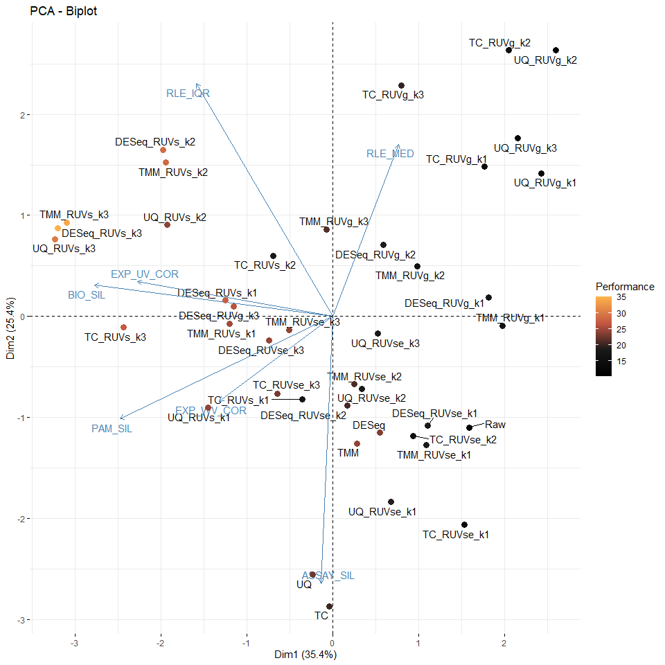

<!-- README.md is generated from README.Rmd. Please edit that file -->

# enRUVseq

<!-- badges: start -->
<!-- badges: end -->

The goal of `enRUVseq` is to perform normalization on RNA-seq including
enrichment (NAD-RNA-seq) using spike-in.

The main functions for normalizing enrichment variation between samples
were inspired by [RUVSeq](https://github.com/drisso/RUVSeq).

## Installation

You can install the development version of enRUVseq from
[GitHub](https://github.com/) with:

``` r
# install.packages("devtools")
devtools::install_github("thereallda/enRUVseq")
```

## Workflow

``` r
library(enRUVseq)
library(tidyverse)
library(edgeR)
library(paintingr)
library(patchwork)
```

### Load data

Metadata including sample information.

``` r
meta <- read.csv('data-raw/metadata_enRUVg.csv', comment.char = '#')
meta
#>     id   condition replicate
#> 1   G1  High.Input         1
#> 2   G2  High.Input         2
#> 3   G3  High.Input         3
#> 4   G4   Mid.Input         1
#> 5   G5   Mid.Input         2
#> 6   G6   Mid.Input         3
#> 7   G7   Low.Input         1
#> 8   G8   Low.Input         2
#> 9   G9   Low.Input         3
#> 10 G10 High.Enrich         1
#> 11 G11 High.Enrich         2
#> 12 G12 High.Enrich         3
#> 13 G13  Mid.Enrich         1
#> 14 G14  Mid.Enrich         2
#> 15 G15  Mid.Enrich         3
#> 16 G16  Low.Enrich         1
#> 17 G17  Low.Enrich         2
#> 18 G18  Low.Enrich         3
```

NAD-RNA-Sequencing data, with genes in rows and samples in columns.

``` r
counts.df <- read.csv('data-raw/Counts_enRUVg.csv', row.names = 1)
counts.df[1:3,]
#>                 G1 G2 G3 G4 G5 G6 G7 G8 G9 G10 G11 G12 G13 G14 G15 G16 G17 G18
#> ENSG00000223972  0  0  0  0  0  1  0  0  0   0   0   1   0   2   0   0   0   0
#> ENSG00000227232  6 14  3  5  6  3  8  4 11  11   3   2   7   6   1   4   2   1
#> ENSG00000278267  1  0  0  0  1  0  0  0  0   1   0   0   0   0   0   0   0   0
```

### Filtering low-expressed genes

``` r
spikeInPrefix <- '^FB'
keep <- filterByExpr(counts.df, group = meta$condition)
counts_keep <- counts.df[keep,]
dim(counts.df); dim(counts_keep)
#> [1] 76290    18
#> [1] 21035    18
```

### Perform normalization and assessment

``` r
ONE_obj <- enONE(counts_keep, group = meta$condition, spike.in.prefix = '^FB',
                 ruv.norm = TRUE, ruv.k = 3)
#> The number of negative control genes for RUV: 1000 
#> The number of positive evaluation genes: 1000 
#> The number of negative evaluation genes: 1000 
#> Apply normalization...
#> Perform assessment...
```

``` r
names(ONE_obj)
#> [1] "norm.data.ls"    "norm.assessment"
```

performance of normalization

``` r
ONE_obj$norm.assessment$performance
#>                BIO_SIL ASSAY_SIL PAM_SIL RLE_MED RLE_IQR EXP_WV_COR EXP_UV_COR
#> DESeq_RUVs_k3       39        18      41      30      39         37         41
#> TMM_RUVs_k3         38        17      40      28      40         36         40
#> UQ_RUVs_k3          40        11      39      10      41         32         38
#> DESeq_RUVs_k2       37        10      36      34      34         14         36
#> TMM_RUVs_k2         36        12      37      32      35         12         35
#> DESeq_RUVs_k1       33        19      30      33      17         29         31
#> TC_RUVs_k3          41        16      38       4      38         39         13
#> DESeq_RUVg_k3       29        25      17      18      31         35         29
#> TMM_RUVs_k1         32        21      28      22      19         22         32
#> DESeq_RUVse_k3      20        28      15      16      26         30         37
#> UQ_RUVs_k1          31        26      29       9      18         25         33
#> TMM                 17        40      34      38       4          9         28
#> TMM_RUVse_k3        14        27      12      17      27         34         39
#> UQ_RUVs_k2          35         9      32      11      33         15         34
#> DESeq               16        39      33      41       2          7         27
#> TC_RUVse_k3         27        29      16       7      29         40         14
#> UQ                  15        41      35      13       3         26         25
#> TMM_RUVg_k3         22        14      10      21      30         31         22
#> TMM_RUVse_k2        18        37      25      20      21          3         23
#> DESeq_RUVse_k2      21        36      24      19      15          4         26
#> TC                  23        38      31       3       5         38          3
#> TC_RUVg_k3          25         5       3      40      28         17         20
#> UQ_RUVse_k1         12        35      21      14       7         28         17
#> DESeq_RUVg_k2       28        22       9      25      23          6         19
#> UQ_RUVse_k2         24        32      19      15      14          2         24
#> UQ_RUVse_k3          3        23      14      12      25         23         30
#> TMM_RUVse_k1        10        33      23      23       8         18         15
#> DESeq_RUVse_k1       9        31      22      24       9         19         16
#> TC_RUVs_k2          34         8      27       5      32         16          7
#> DESeq_RUVg_k1        8        20      11      37      12         24         11
#> TC_RUVs_k1          30        13      26       2      13         27         10
#> TMM_RUVg_k1          4        24      13      36      11         20         12
#> TMM_RUVg_k2         26        15       8      26      10          8         21
#> TC_RUVse_k2         19        34      20       8      16          5          8
#> TC_RUVg_k2           5         2       5      39      37         13          6
#> TC_RUVg_k1          13         4       2      29      22         21          9
#> TC_RUVse_k1          6        30      18       6       6         33          1
#> UQ_RUVg_k3           2         3       1      27      24         10         18
#> UQ_RUVg_k1           7         6       4      31      20         11          5
#> UQ_RUVg_k2           1         1       6      35      36          1          2
#> Raw                 11         7       7       1       1         41          4
#>                PERF_SCORE
#> DESeq_RUVs_k3    35.00000
#> TMM_RUVs_k3      34.14286
#> UQ_RUVs_k3       30.14286
#> DESeq_RUVs_k2    28.71429
#> TMM_RUVs_k2      28.42857
#> DESeq_RUVs_k1    27.42857
#> TC_RUVs_k3       27.00000
#> DESeq_RUVg_k3    26.28571
#> TMM_RUVs_k1      25.14286
#> DESeq_RUVse_k3   24.57143
#> UQ_RUVs_k1       24.42857
#> TMM              24.28571
#> TMM_RUVse_k3     24.28571
#> UQ_RUVs_k2       24.14286
#> DESeq            23.57143
#> TC_RUVse_k3      23.14286
#> UQ               22.57143
#> TMM_RUVg_k3      21.42857
#> TMM_RUVse_k2     21.00000
#> DESeq_RUVse_k2   20.71429
#> TC               20.14286
#> TC_RUVg_k3       19.71429
#> UQ_RUVse_k1      19.14286
#> DESeq_RUVg_k2    18.85714
#> UQ_RUVse_k2      18.57143
#> UQ_RUVse_k3      18.57143
#> TMM_RUVse_k1     18.57143
#> DESeq_RUVse_k1   18.57143
#> TC_RUVs_k2       18.42857
#> DESeq_RUVg_k1    17.57143
#> TC_RUVs_k1       17.28571
#> TMM_RUVg_k1      17.14286
#> TMM_RUVg_k2      16.28571
#> TC_RUVse_k2      15.71429
#> TC_RUVg_k2       15.28571
#> TC_RUVg_k1       14.28571
#> TC_RUVse_k1      14.28571
#> UQ_RUVg_k3       12.14286
#> UQ_RUVg_k1       12.00000
#> UQ_RUVg_k2       11.71429
#> Raw              10.28571
```

PCA biplot

``` r
pca.nsp.eval <- prcomp(ONE_obj$norm.assessment$performance[,-ncol(ONE_obj$norm.assessment$performance)], scale = TRUE)
ggPCA_Biplot(pca.nsp.eval, performance_score = ONE_obj$norm.assessment$performance$PERF_SCORE)
```



save

``` r
save(ONE_obj, file='data/NormAssess.rda')
```

### The best performance

``` r
# select the best normalization
best.norm <- rownames(ONE_obj$norm.assessment$performance[1,])
best.norm.data <- ONE_obj$norm.data.ls[[best.norm]]
best.norm
#> [1] "DESeq_RUVs_k3"
```

### DE

``` r
counts_nsp <- counts_keep[!rownames(counts_keep) %in% spikeInPrefix, ]
contrast_df <- data.frame(Group1 = unique(grep("Enrich", meta$condition, value = TRUE)),
                          Group2 = unique(grep("Input", meta$condition, value = TRUE)))
de.best.norm <- edgeRDE(counts_nsp[!rownames(counts_nsp) %in% c('Syn1', 'Syn2'),],
                        group = meta$condition,
                        contrast.df = contrast_df,
                        norm.factors = ONE_obj$norm.data.ls$DESeq$normFactor, # chose as best norm
                        adjust.factors = best.norm.data$adjustFactor
                        )
```

``` r
nad_df1 <- reduceRes(de.best.norm$res.sig.ls, fc.col = 'logFC')
nad_df1$Group <- gsub('\\..*', '', nad_df1$Group)
nad_df1$Group <- factor(nad_df1$Group, levels = unique(nad_df1$Group))
bxp1 <- BetweenStatPlot(nad_df1, x='Group', y='logFC', color='Group') + ggtitle('Human')
```
