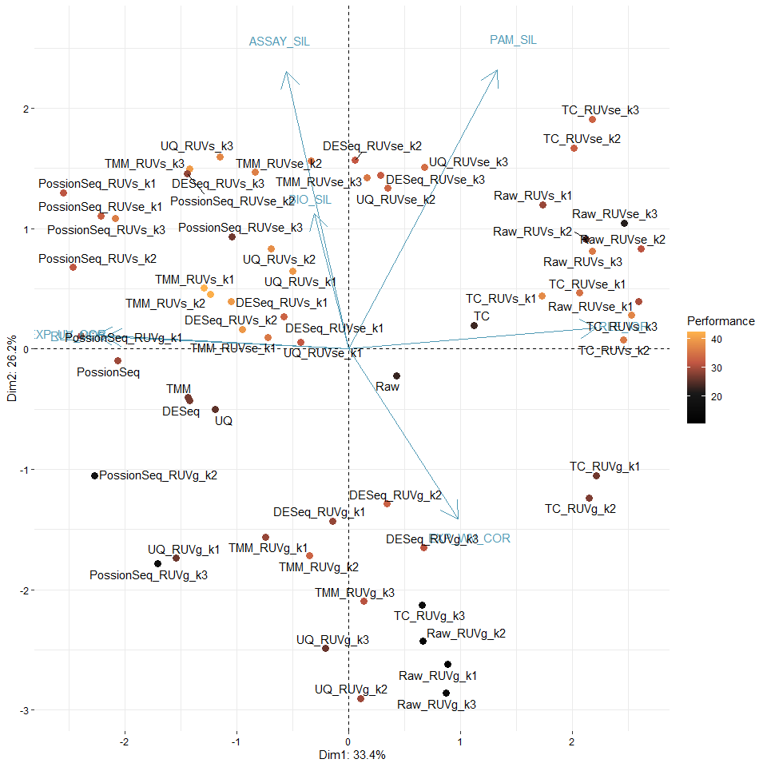
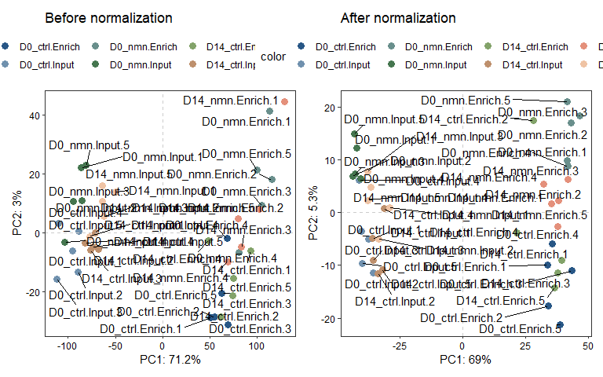

<!-- README.md is generated from README.Rmd. Please edit that file -->

# enRUVseq

<!-- badges: start -->
<!-- badges: end -->

The goal of `enRUVseq` is to perform normalization on RNA-seq including
enrichment (NAD-RNA-seq) using spike-in.

The main functions for normalizing enrichment variation between samples
were inspired by [RUVSeq](https://github.com/drisso/RUVSeq).

## Installation

You can install the development version of enRUVseq from
[GitHub](https://github.com/) with:

``` r
# install.packages("devtools")
devtools::install_github("thereallda/enRUVseq")
```

## Workflow

``` r
library(enRUVseq)
library(tidyverse)
library(edgeR)
library(paintingr)
library(patchwork)
library(SummarizedExperiment)
```

### Load data

Metadata including sample information.

``` r
meta <- read.csv('data-raw/metadata.csv', comment.char = '#')
meta
#>     id       condition replicate
#> 1   C1   D0_ctrl.Input         1
#> 2   C2   D0_ctrl.Input         2
#> 3   C3   D0_ctrl.Input         3
#> 4   C4   D0_ctrl.Input         4
#> 5   C5   D0_ctrl.Input         5
#> 6   C6  D14_ctrl.Input         1
#> 7   C7  D14_ctrl.Input         2
#> 8   C8  D14_ctrl.Input         3
#> 9   C9  D14_ctrl.Input         4
#> 10 C10  D14_ctrl.Input         5
#> 11 C11  D0_ctrl.Enrich         1
#> 12 C12  D0_ctrl.Enrich         2
#> 13 C13  D0_ctrl.Enrich         3
#> 14 C14  D0_ctrl.Enrich         4
#> 15 C15  D0_ctrl.Enrich         5
#> 16 C16 D14_ctrl.Enrich         1
#> 17 C17 D14_ctrl.Enrich         2
#> 18 C18 D14_ctrl.Enrich         3
#> 19 C19 D14_ctrl.Enrich         4
#> 20 C20 D14_ctrl.Enrich         5
#> 21  N1    D0_nmn.Input         1
#> 22  N2    D0_nmn.Input         2
#> 23  N3    D0_nmn.Input         3
#> 24  N4    D0_nmn.Input         4
#> 25  N5    D0_nmn.Input         5
#> 26  N6   D14_nmn.Input         1
#> 27  N7   D14_nmn.Input         2
#> 28  N8   D14_nmn.Input         3
#> 29  N9   D14_nmn.Input         4
#> 30 N10   D14_nmn.Input         5
#> 31 N11   D0_nmn.Enrich         1
#> 32 N12   D0_nmn.Enrich         2
#> 33 N13   D0_nmn.Enrich         3
#> 34 N14   D0_nmn.Enrich         4
#> 35 N15   D0_nmn.Enrich         5
#> 36 N16  D14_nmn.Enrich         1
#> 37 N17  D14_nmn.Enrich         2
#> 38 N18  D14_nmn.Enrich         3
#> 39 N19  D14_nmn.Enrich         4
#> 40 N20  D14_nmn.Enrich         5
```

NAD-RNA-Sequencing data, with genes in rows and samples in columns.

``` r
counts.df <- read.csv('data-raw/Counts.csv', row.names = 1)
counts.df[1:3,]
#>                    C1 C2 C3 C4 C5 C6 C7 C8 C9 C10 C11 C12 C13 C14 C15 C16 C17
#> ENSCAFG00845015183  0  0  0  0  0  0  0  0  0   0   0   0   0   0   0   0   0
#> ENSCAFG00845015195  0  0  0  0  0  0  0  0  0   0   0   0   0   0   0   0   0
#> ENSCAFG00845015208  0  0  0  0  0  0  0  0  0   0   0   0   0   0   0   0   0
#>                    C18 C19 C20 N1 N2 N3 N4 N5 N6 N7 N8 N9 N10 N11 N12 N13 N14
#> ENSCAFG00845015183   0   0   0  0  0  0  0  0  0  0  0  0   0   0   0   0   0
#> ENSCAFG00845015195   0   0   0  0  0  0  0  0  0  0  0  0   0   0   0   0   0
#> ENSCAFG00845015208   0   0   0  0  0  0  0  0  0  0  0  0   0   0   0   0   0
#>                    N15 N16 N17 N18 N19 N20
#> ENSCAFG00845015183   0   0   0   0   0   0
#> ENSCAFG00845015195   0   0   0   0   0   0
#> ENSCAFG00845015208   0   0   0   0   0   0
```

### Filtering low-expressed genes

``` r
keep <- filterByExpr(counts.df, group = meta$condition)
counts_keep <- counts.df[keep,]
dim(counts.df); dim(counts_keep)
#> [1] 48735    40
#> [1] 28685    40
```

### Create Enone object

Use “input.id” and “enrich.id” to specify the id of input and enrich
library, which should be the same as `group`. If `group` is
`c("D0_ctrl.Input", "D0_ctrl.Enrich",...)`, then `input.id` = ‘Input’
and `enrich.id` = ‘Enrich’.

`synthetic.id` is a vector specify the ids of synthetic RNA, if
included.

``` r
# set-up
enrich_group <- gsub(".*\\.", "", meta$condition)
spikeInPrefix <- '^FB'
# create Enone
Enone <- createEnone(data = counts_keep,
                     bio.group = meta$condition,
                     enrich.group = enrich_group,
                     batch.group = NULL,
                     spike.in.prefix = spikeInPrefix,
                     synthetic.id = c('Syn1','Syn2'),
                     input.id = "Input",
                     enrich.id = "Enrich"
                     )
Enone
#> class: Enone 
#> dim: 28685 40 
#> metadata(0):
#> assays(1): ''
#> rownames(28685): ENSCAFG00845015217 ENSCAFG00845015316 ... Syn1 Syn2
#> rowData names(3): GeneID SpikeIn Synthetic
#> colnames(40): C1 C2 ... N19 N20
#> colData names(5): id condition enrich replicate batch
```

Raw counts (sample + spike-in) can be accessed with

``` r
assay(Enone)[1:3,];dim(assay(Enone))
#>                      C1   C2   C3   C4   C5   C6  C7   C8  C9  C10 C11 C12 C13
#> ENSCAFG00845015217   17   23  158   17   16   14   9   95  21   11  14  12  67
#> ENSCAFG00845015316   56  108   88  123   86   47  63   47  51   49 125 136  93
#> ENSCAFG00845015457 1699 1671 1541 2073 2866 1463 766 1455 958 1092 419 352 287
#>                    C14 C15 C16 C17 C18 C19 C20   N1   N2   N3   N4   N5  N6  N7
#> ENSCAFG00845015217  12   9   8  35  78  15   7   15   99   99  122   89   8 103
#> ENSCAFG00845015316 135 102  36  64  91  46  92  108   88   78   69   78  43  45
#> ENSCAFG00845015457 358 640 279 327 351 305 262 1907 1914 1127 1113 1766 854 748
#>                     N8  N9  N10 N11 N12 N13 N14 N15 N16 N17 N18 N19 N20
#> ENSCAFG00845015217  92 114   94  18  30  58  41  41   3  62  35  62  55
#> ENSCAFG00845015316  65  70   89 168  75 100 146  75  39  30 102  68  71
#> ENSCAFG00845015457 547 456 1145 269 279 151 189 386 162 263 158  90 360
#> [1] 28685    40
```

Sample information is stored in `colData`

``` r
colData(Enone)
#> DataFrame with 40 rows and 5 columns
#>              id      condition      enrich replicate       batch
#>     <character>    <character> <character> <numeric> <character>
#> C1           C1  D0_ctrl.Input       Input         1          NA
#> C2           C2  D0_ctrl.Input       Input         2          NA
#> C3           C3  D0_ctrl.Input       Input         3          NA
#> C4           C4  D0_ctrl.Input       Input         4          NA
#> C5           C5  D0_ctrl.Input       Input         5          NA
#> ...         ...            ...         ...       ...         ...
#> N16         N16 D14_nmn.Enrich      Enrich         1          NA
#> N17         N17 D14_nmn.Enrich      Enrich         2          NA
#> N18         N18 D14_nmn.Enrich      Enrich         3          NA
#> N19         N19 D14_nmn.Enrich      Enrich         4          NA
#> N20         N20 D14_nmn.Enrich      Enrich         5          NA
```

### Perform normalization and assessment

Normalization and assessment can be achieved by wrapper function `enONE`

``` r
Enone <- enONE(Enone, 
               ruv.norm = TRUE, ruv.k = 3,
               pam.krange = 2:6, pc.k = 3
               )
#> The number of negative control genes for RUV: 1000 
#> The number of positive evaluation genes: 1000 
#> The number of negative evaluation genes: 1000 
#> Apply normalization...
#> Perform assessment...
```

Selected gene sets are stored in `rowData`, including:

-   `NegControl`: Boolean value indicate whether this gene is a member
    of the negative control gene sets for RUV, default the most 1000 not
    enriched genes in spike_in are selected.
-   `NegEvaluation`: Boolean value indicate whether this gene is a
    member of the negative evaluation gene set, default the most 1000
    not variable genes in samples are selected.
-   `PosEvaluation`: Boolean value indicate whether this gene is a
    member of the positive evaluation gene set, default the most 1000
    variable genes in samples are selected.

``` r
rowData(Enone)
#> DataFrame with 28685 rows and 6 columns
#>                                GeneID   SpikeIn Synthetic NegControl
#>                           <character> <logical> <logical>  <logical>
#> ENSCAFG00845015217 ENSCAFG00845015217     FALSE     FALSE      FALSE
#> ENSCAFG00845015316 ENSCAFG00845015316     FALSE     FALSE      FALSE
#> ENSCAFG00845015457 ENSCAFG00845015457     FALSE     FALSE      FALSE
#> ENSCAFG00845015550 ENSCAFG00845015550     FALSE     FALSE      FALSE
#> ENSCAFG00845015637 ENSCAFG00845015637     FALSE     FALSE      FALSE
#> ...                               ...       ...       ...        ...
#> FBgn0085753               FBgn0085753      TRUE     FALSE      FALSE
#> FBgn0267511               FBgn0267511      TRUE     FALSE       TRUE
#> FBgn0267505               FBgn0267505      TRUE     FALSE      FALSE
#> Syn1                             Syn1     FALSE      TRUE      FALSE
#> Syn2                             Syn2     FALSE      TRUE      FALSE
#>                    NegEvaluation PosEvaluation
#>                        <logical>     <logical>
#> ENSCAFG00845015217         FALSE         FALSE
#> ENSCAFG00845015316         FALSE         FALSE
#> ENSCAFG00845015457         FALSE         FALSE
#> ENSCAFG00845015550         FALSE         FALSE
#> ENSCAFG00845015637         FALSE         FALSE
#> ...                          ...           ...
#> FBgn0085753                FALSE         FALSE
#> FBgn0267511                FALSE         FALSE
#> FBgn0267505                FALSE         FALSE
#> Syn1                       FALSE         FALSE
#> Syn2                       FALSE         FALSE
```

You can get specific gene set by `getGeneSet`. Name of the gene set
provided must be the same as the column names of rowData.

``` r
getGeneSet(Enone, name = "NegControl")[1:5]
#> [1] "FBgn0267987" "FBgn0265074" "FBgn0266906" "FBgn0031256" "FBgn0266032"
```

Normalized counts are stored in `counts` slot in which `sample` slot
holds the counts from sample and `spike_in` slot for spike-in counts.

``` r
names(Enone@counts$sample)
#>  [1] "TC"             "UQ"             "TMM"            "DESeq"         
#>  [5] "Raw"            "TC_RUVg_k1"     "TC_RUVs_k1"     "TC_RUVse_k1"   
#>  [9] "TC_RUVg_k2"     "TC_RUVs_k2"     "TC_RUVse_k2"    "TC_RUVg_k3"    
#> [13] "TC_RUVs_k3"     "TC_RUVse_k3"    "UQ_RUVg_k1"     "UQ_RUVs_k1"    
#> [17] "UQ_RUVse_k1"    "UQ_RUVg_k2"     "UQ_RUVs_k2"     "UQ_RUVse_k2"   
#> [21] "UQ_RUVg_k3"     "UQ_RUVs_k3"     "UQ_RUVse_k3"    "TMM_RUVg_k1"   
#> [25] "TMM_RUVs_k1"    "TMM_RUVse_k1"   "TMM_RUVg_k2"    "TMM_RUVs_k2"   
#> [29] "TMM_RUVse_k2"   "TMM_RUVg_k3"    "TMM_RUVs_k3"    "TMM_RUVse_k3"  
#> [33] "DESeq_RUVg_k1"  "DESeq_RUVs_k1"  "DESeq_RUVse_k1" "DESeq_RUVg_k2" 
#> [37] "DESeq_RUVs_k2"  "DESeq_RUVse_k2" "DESeq_RUVg_k3"  "DESeq_RUVs_k3" 
#> [41] "DESeq_RUVse_k3" "Raw_RUVg_k1"    "Raw_RUVs_k1"    "Raw_RUVse_k1"  
#> [45] "Raw_RUVg_k2"    "Raw_RUVs_k2"    "Raw_RUVse_k2"   "Raw_RUVg_k3"   
#> [49] "Raw_RUVs_k3"    "Raw_RUVse_k3"
```

Counts matrix can be accessed by `Counts`

``` r
Counts(Enone, slot='sample', method='DESeq_RUVs_k2')[1:3,]
#>                           C1        C2        C3        C4        C5        C6
#> ENSCAFG00845015217  3.901736  4.761904 15.565648  4.554552  5.809804  4.345281
#> ENSCAFG00845015316  3.026822  5.068405  3.596972  4.799095  4.327039  3.020960
#> ENSCAFG00845015457 43.445121 38.284290 31.153195 35.621599 50.514806 41.143180
#>                           C7        C8        C9       C10       C11       C12
#> ENSCAFG00845015217  3.514411 14.977263  4.968487  4.140104  5.218785  4.747286
#> ENSCAFG00845015316  3.843628  2.877555  2.850568  2.968736 10.792579 12.455732
#> ENSCAFG00845015457 21.964920 37.055740 22.326757 26.111268 23.065313 20.710760
#>                          C13       C14       C15       C16       C17       C18
#> ENSCAFG00845015217 16.479863  7.748586  6.915218  5.463649  6.565886 23.422922
#> ENSCAFG00845015316  8.954316 13.182752  9.456582  5.134640  7.500187  9.550909
#> ENSCAFG00845015457 19.703606 16.190347 23.575215 20.533775 24.716921 22.170090
#>                          C19       C20        N1        N2        N3        N4
#> ENSCAFG00845015217  7.300300  4.468938  4.843313 13.432673 12.852690 10.748332
#> ENSCAFG00845015316  4.878766  9.968874  5.381436  4.477452  4.274758  3.326142
#> ENSCAFG00845015457 15.017887 16.021378 40.447762 44.560728 34.887804 33.362232
#>                           N5        N6       N7        N8        N9       N10
#> ENSCAFG00845015217 14.877625  4.038758 17.67058 13.321180 12.411532 18.783764
#> ENSCAFG00845015316  4.375662  3.157234  3.11223  4.271125  4.068024  5.206141
#> ENSCAFG00845015457 44.289031 24.172589 20.88307 20.391490 17.006821 28.464775
#>                         N11      N12      N13       N14      N15       N16
#> ENSCAFG00845015217 17.39356 19.81773 14.15013  8.526797 21.73783  5.867887
#> ENSCAFG00845015316 23.07703 12.49779 14.13954 16.392284 10.25739  7.842360
#> ENSCAFG00845015457 11.24024 14.37402 20.95900 22.381441 20.87181 10.945719
#>                          N17       N18       N19       N20
#> ENSCAFG00845015217 31.438509  9.890411  9.835400 28.665963
#> ENSCAFG00845015316  5.264078 11.620236  7.758362  7.690093
#> ENSCAFG00845015457 15.794634 13.872150 12.364746 14.349609
```

Factors of normalization are stored in slot `enone_factor` in which
`sample` slot holds the factors of sample and `spike_in` slot for
spike-in.

``` r
names(Enone@enone_factor$sample)
#>  [1] "TC"             "UQ"             "TMM"            "DESeq"         
#>  [5] "Raw"            "TC_RUVg_k1"     "TC_RUVs_k1"     "TC_RUVse_k1"   
#>  [9] "TC_RUVg_k2"     "TC_RUVs_k2"     "TC_RUVse_k2"    "TC_RUVg_k3"    
#> [13] "TC_RUVs_k3"     "TC_RUVse_k3"    "UQ_RUVg_k1"     "UQ_RUVs_k1"    
#> [17] "UQ_RUVse_k1"    "UQ_RUVg_k2"     "UQ_RUVs_k2"     "UQ_RUVse_k2"   
#> [21] "UQ_RUVg_k3"     "UQ_RUVs_k3"     "UQ_RUVse_k3"    "TMM_RUVg_k1"   
#> [25] "TMM_RUVs_k1"    "TMM_RUVse_k1"   "TMM_RUVg_k2"    "TMM_RUVs_k2"   
#> [29] "TMM_RUVse_k2"   "TMM_RUVg_k3"    "TMM_RUVs_k3"    "TMM_RUVse_k3"  
#> [33] "DESeq_RUVg_k1"  "DESeq_RUVs_k1"  "DESeq_RUVse_k1" "DESeq_RUVg_k2" 
#> [37] "DESeq_RUVs_k2"  "DESeq_RUVse_k2" "DESeq_RUVg_k3"  "DESeq_RUVs_k3" 
#> [41] "DESeq_RUVse_k3" "Raw_RUVg_k1"    "Raw_RUVs_k1"    "Raw_RUVse_k1"  
#> [45] "Raw_RUVg_k2"    "Raw_RUVs_k2"    "Raw_RUVse_k2"   "Raw_RUVg_k3"   
#> [49] "Raw_RUVs_k3"    "Raw_RUVse_k3"
```

Factors can be accessed by `getFactor`

If RUV was not performed, return only `normFactor` for scaling.

``` r
getFactor(Enone, slot='sample', method='DESeq')
#> $normFactor
#>        C1        C2        C3        C4        C5        C6        C7        C8 
#> 1.2775421 1.2738424 1.3208635 1.2402384 1.2211541 1.2029253 1.2786250 1.2354491 
#>        C9       C10       C11       C12       C13       C14       C15       C16 
#> 1.2427595 1.2676845 0.8350819 0.8534154 0.8262196 0.7944167 0.7550536 0.7586611 
#>       C17       C18       C19       C20        N1        N2        N3        N4 
#> 0.8691921 0.7924529 0.8637842 0.8299783 1.2012042 1.2489225 1.3063197 1.3633998 
#>        N5        N6        N7        N8        N9       N10       N11       N12 
#> 1.2238373 1.2144533 1.2684415 1.3087462 1.3875672 1.2031263 0.7069106 0.6807173 
#>       N13       N14       N15       N16       N17       N18       N19       N20 
#> 0.7171009 0.8205064 0.7259231 0.7689211 0.7647244 0.7974699 0.9411039 0.7767960
```

Otherwise, return both `normFactor` and `adjustFacot`

``` r
getFactor(Enone, slot='sample', method='DESeq_RUVs_k2')
#> $adjustFactor
#>            W_1         W_2
#> C1  -0.8172059 -0.58997644
#> C2  -0.8054795 -0.47386833
#> C3  -0.8472755 -0.60668684
#> C4  -0.9690124 -0.58193164
#> C5  -1.0444921 -0.48947392
#> C6  -0.9074222 -0.62335885
#> C7  -0.8294296 -0.51839974
#> C8  -0.9227080 -0.61210252
#> C9  -0.9096404 -0.59535035
#> C10 -0.9306387 -0.55999998
#> C11 -0.8817397 -0.70421568
#> C12 -0.8172308 -0.62113645
#> C13 -0.8551201 -0.78324011
#> C14 -1.1551356 -0.72501993
#> C15 -1.1731076 -0.63855465
#> C16 -0.9643148 -0.69621015
#> C17 -0.2237320  0.03107185
#> C18 -0.9089170 -0.69391194
#> C19 -1.0221244 -0.67219797
#> C20 -0.9062803 -0.62180142
#> N1  -0.9330107 -0.49066610
#> N2  -0.7921355 -0.42689203
#> N3  -0.8028353 -0.63251006
#> N4  -0.6919774 -0.65251189
#> N5  -0.9054904 -0.54212942
#> N6  -0.9116437 -0.49679251
#> N7  -0.8573788 -0.47747768
#> N8  -0.7398446 -0.55289253
#> N9  -0.6581515 -0.57059302
#> N10 -0.9870895 -0.55408427
#> N11 -1.2149337 -0.38619729
#> N12 -0.7818790  0.08453466
#> N13 -0.5652355 -0.68728420
#> N14 -0.5906325 -0.77621312
#> N15 -0.9503273 -0.35967695
#> N16 -1.0322703 -0.32420430
#> N17 -0.7736641 -0.10123087
#> N18 -0.7386586 -0.67894097
#> N19 -0.4807392 -0.77962102
#> N20 -1.2037654 -0.61749854
#> 
#> $normFactor
#>        C1        C2        C3        C4        C5        C6        C7        C8 
#> 1.2775421 1.2738424 1.3208635 1.2402384 1.2211541 1.2029253 1.2786250 1.2354491 
#>        C9       C10       C11       C12       C13       C14       C15       C16 
#> 1.2427595 1.2676845 0.8350819 0.8534154 0.8262196 0.7944167 0.7550536 0.7586611 
#>       C17       C18       C19       C20        N1        N2        N3        N4 
#> 0.8691921 0.7924529 0.8637842 0.8299783 1.2012042 1.2489225 1.3063197 1.3633998 
#>        N5        N6        N7        N8        N9       N10       N11       N12 
#> 1.2238373 1.2144533 1.2684415 1.3087462 1.3875672 1.2031263 0.7069106 0.6807173 
#>       N13       N14       N15       N16       N17       N18       N19       N20 
#> 0.7171009 0.8205064 0.7259231 0.7689211 0.7647244 0.7974699 0.9411039 0.7767960
```

Check the metrics of normalizations (ranked by scores in decreasing
order).

``` r
head(getMetrics(Enone))
#>                   BIO_SIL ASSAY_SIL BATCH_SIL   PAM_SIL     RLE_MED    RLE_IQR
#> TMM_RUVs_k2    0.27267028 0.3485566         0 0.6866165 0.001237167 0.02817226
#> TMM_RUVs_k1    0.24970779 0.3644590         0 0.6805773 0.001507430 0.03396857
#> TMM_RUVs_k3    0.12349069 0.3588535         0 0.6914945 0.001179066 0.02580658
#> TMM_RUVse_k2  -0.03147709 0.3852657         0 0.7148728 0.001380218 0.02957850
#> UQ_RUVs_k3     0.13703143 0.3575591         0 0.6911226 0.001948951 0.02542455
#> DESeq_RUVs_k2  0.28920891 0.3457821         0 0.6846519 0.002195862 0.03031955
#>               EXP_WV_COR EXP_UV_COR
#> TMM_RUVs_k2    0.8456455  0.2643505
#> TMM_RUVs_k1    0.8956022  0.3101906
#> TMM_RUVs_k3    0.6617586  0.2784629
#> TMM_RUVse_k2   0.9220336  0.4120447
#> UQ_RUVs_k3     0.6662381  0.2749395
#> DESeq_RUVs_k2  0.8621424  0.2631729
```

Check the performance of normalizations (ranked by scores in decreasing
order). Higher score means better performance.

``` r
head(getScore(Enone))
#>               BIO_SIL ASSAY_SIL BATCH_SIL PAM_SIL RLE_MED RLE_IQR EXP_WV_COR
#> TMM_RUVs_k2        48        28         1      26      46      21         18
#> TMM_RUVs_k1        43        42         1      21      41      12         28
#> TMM_RUVs_k3        35        36         1      31      47      28          2
#> TMM_RUVse_k2       18        47         1      38      44      18         35
#> UQ_RUVs_k3         38        34         1      30      37      29          3
#> DESeq_RUVs_k2      49        25         1      25      31      17         21
#>               EXP_UV_COR    SCORE
#> TMM_RUVs_k2           49 33.71429
#> TMM_RUVs_k1           44 33.00000
#> TMM_RUVs_k3           47 32.28571
#> TMM_RUVse_k2          25 32.14286
#> UQ_RUVs_k3            48 31.28571
#> DESeq_RUVs_k2         50 31.14286
```

#### PCA biplot

if batch not provided, preclude `BATCH_SIL` column

``` r
pca.nsp.eval <- prcomp(Enone@enone_score[,-c(3, 9)], scale = TRUE)
ggPCA_Biplot(pca.nsp.eval, performance_score = Enone@enone_score$SCORE)
```



save

``` r
save(Enone, file='data/NormAssess.rda')
```

### The best performance

``` r
# select the best normalization
best.norm <- rownames(Enone@enone_score[1,])
best.norm.data <- Counts(Enone, slot = 'sample', method = best.norm)
best.norm.factors <- getFactor(Enone, slot = 'sample', method = best.norm)
best.norm
#> [1] "TMM_RUVs_k2"
```

### Effect of normalization

we use PCA to visualize the counts from non-spike-in samples before and
after the normalization.

``` r
samples_name <- paste(meta$condition, meta$replicate, sep='.')
p1 <- ggPCA(log1p(Counts(Enone, slot='sample', 'Raw')), 
            color = meta$condition,
            label = samples_name, vst.norm = FALSE) + ggtitle('Before normalization')
p2 <- ggPCA(log1p(best.norm.data), 
            color = meta$condition,
            label = samples_name, vst.norm = FALSE) + ggtitle('After normalization')
p1 + p2
```



### FindEnrichment

You can find enriched genes by `FindEnrichment`.

Enriched genes are saved at slots `Enone@enrichment` (all) and
`Enone@enrichment_filtered` (filtered).

Default criteria for enriched genes is log2-Fold-Change
(enrichment/input) \>= 1 & adjusted p-value \< 0.05.

``` r
Enone <- FindEnrichment(Enone, slot='sample', method = best.norm, 
                        logfc.cutoff = 1, p.cutoff = 0.05)
# get filtered enrichment results
res.best.ls <- getEnrichment(Enone, slot='sample', filter=TRUE)
unlist(lapply(res.best.ls, nrow))
#>   D0_ctrl.Enrich_D0_ctrl.Input D14_ctrl.Enrich_D14_ctrl.Input 
#>                           2404                           2127 
#>     D0_nmn.Enrich_D0_nmn.Input   D14_nmn.Enrich_D14_nmn.Input 
#>                           2835                           2310
```

Each enrichment table is a `data.frame` with a list of genes as rows,
and associated information as columns (GeneID, logFC, p-values, etc.).
The following columns are present in the table:

-   `GeneID`: ID of genes.
-   `logFC`: log2 fold-change between enrichment and input samples.
    Positive values indicate that the gene is more highly enriched in
    the enrichment group.
-   `logCPM`: log2 CPM (counts per million) of the average expression of
    all samples.
-   `LR`: Likelihood ratio of the likelihood ratio test.
-   `PValue`: p-value from the likelihood ratio test.
-   `FDR`: False discovery rate of the p-value, default “BH” method is
    applied.

``` r
head(res.best.ls[[1]])
#>               GeneID    logFC    logCPM       LR        PValue           FDR
#> 1 ENSCAFG00845009430 2.477097  7.643284 689.8843 4.736345e-152 5.508933e-148
#> 2 ENSCAFG00845002083 3.159634 12.583148 688.9320 7.630101e-152 5.508933e-148
#> 3 ENSCAFG00845007784 3.103533  8.694690 638.0708 8.780558e-141 4.226375e-137
#> 4 ENSCAFG00845023387 2.630535  7.120411 596.3554 1.038776e-131 3.749983e-128
#> 5 ENSCAFG00845006300 2.394677  7.279104 595.0941 1.953827e-131 5.642652e-128
#> 6 ENSCAFG00845030865 2.813383 11.090506 582.8083 9.188162e-129 2.211284e-125
```

Reduce list of enrichment and visualize with violin-box plot.

``` r
nad_df1 <- reduceRes(res.best.ls, fc.col = 'logFC')
nad_df1$Group <- gsub('\\..*', '', nad_df1$Group)
nad_df1$Group <- factor(nad_df1$Group, levels = unique(nad_df1$Group))
bxp1 <- BetweenStatPlot(nad_df1, x='Group', y='logFC', color='Group', step.increase = 0.6)
bxp1
```


### Handling spike-in

Normalization for counts from spike-in

``` r
Enone <- UseNormalization(Enone, slot="spike_in", method="TMM_RUVse_k3")
```

And we can find enriched genes for spike-in

``` r
Enone <- FindEnrichment(Enone, slot='spike_in', method = "TMM_RUVse_k3", 
                        logfc.cutoff = 1, p.cutoff = 0.05)
# get filtered enrichment results
res.spikein.ls <- getEnrichment(Enone, slot='spike_in', filter=TRUE)
unlist(lapply(res.spikein.ls, nrow))
#>   D0_ctrl.Enrich_D0_ctrl.Input D14_ctrl.Enrich_D14_ctrl.Input 
#>                           1999                           2145 
#>     D0_nmn.Enrich_D0_nmn.Input   D14_nmn.Enrich_D14_nmn.Input 
#>                           2001                           1932
```
