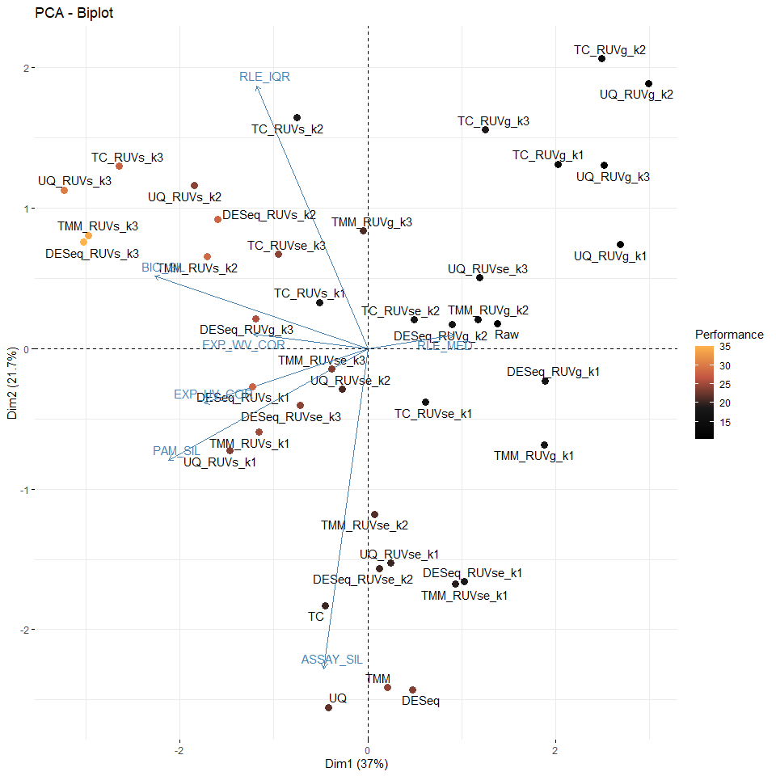
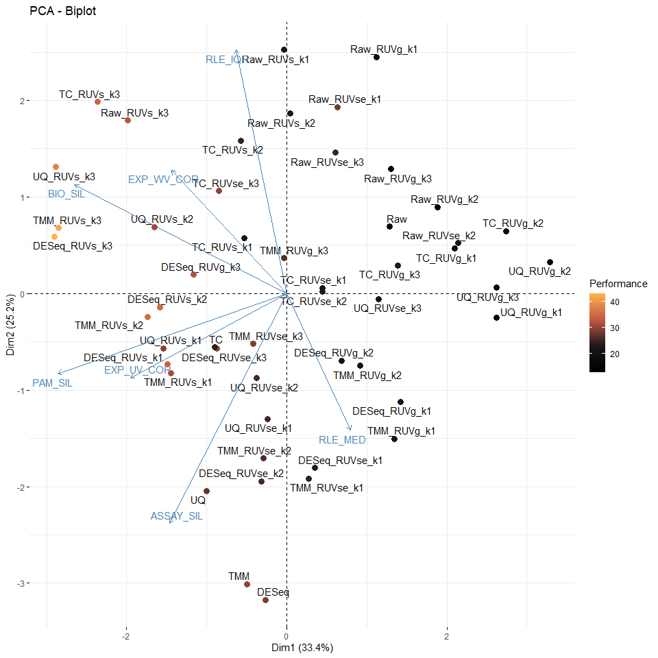

<!-- README.md is generated from README.Rmd. Please edit that file -->

# enRUVseq

<!-- badges: start -->
<!-- badges: end -->

The goal of `enRUVseq` is to perform normalization on RNA-seq including
enrichment (NAD-RNA-seq) using spike-in.

The main functions for normalizing enrichment variation between samples
were inspired by [RUVSeq](https://github.com/drisso/RUVSeq).

## Installation

You can install the development version of enRUVseq from
[GitHub](https://github.com/) with:

``` r
# install.packages("devtools")
devtools::install_github("thereallda/enRUVseq")
```

## Workflow

``` r
library(enRUVseq)
library(tidyverse)
library(edgeR)
library(paintingr)
library(patchwork)
```

### Load data

Metadata including sample information.

``` r
meta <- read.csv('data-raw/metadata_enRUVg.csv', comment.char = '#')
meta
#>     id   condition replicate
#> 1   G1  High.Input         1
#> 2   G2  High.Input         2
#> 3   G3  High.Input         3
#> 4   G4   Mid.Input         1
#> 5   G5   Mid.Input         2
#> 6   G6   Mid.Input         3
#> 7   G7   Low.Input         1
#> 8   G8   Low.Input         2
#> 9   G9   Low.Input         3
#> 10 G10 High.Enrich         1
#> 11 G11 High.Enrich         2
#> 12 G12 High.Enrich         3
#> 13 G13  Mid.Enrich         1
#> 14 G14  Mid.Enrich         2
#> 15 G15  Mid.Enrich         3
#> 16 G16  Low.Enrich         1
#> 17 G17  Low.Enrich         2
#> 18 G18  Low.Enrich         3
```

NAD-RNA-Sequencing data, with genes in rows and samples in columns.

``` r
counts.df <- read.csv('data-raw/Counts_enRUVg.csv', row.names = 1)
counts.df[1:3,]
#>                 G1 G2 G3 G4 G5 G6 G7 G8 G9 G10 G11 G12 G13 G14 G15 G16 G17 G18
#> ENSG00000223972  0  0  0  0  0  1  0  0  0   0   0   1   0   2   0   0   0   0
#> ENSG00000227232  6 14  3  5  6  3  8  4 11  11   3   2   7   6   1   4   2   1
#> ENSG00000278267  1  0  0  0  1  0  0  0  0   1   0   0   0   0   0   0   0   0
```

### Filtering low-expressed genes

``` r
spikeInPrefix <- '^FB'
keep <- filterByExpr(counts.df, group = meta$condition)
counts_keep <- counts.df[keep,]
dim(counts.df); dim(counts_keep)
#> [1] 76290    18
#> [1] 21035    18
```

### Perform normalization and assessment

Use “input.id” and “enrich.id” to specify the id of input and enrich
library, which should be the same as `group`. If `group` is
`c("High.Input", "High.Enrich",...)`, then `input.id` = ‘Input’ and
`enrich.id` = ‘Enrich’.

``` r
ONE_obj <- enONE(counts_keep, group = meta$condition, spike.in.prefix = '^FB',
                 input.id = 'Input', enrich.id = 'Enrich',
                 ruv.norm = TRUE, ruv.k = 3)
#> The number of negative control genes for RUV: 1000 
#> The number of positive evaluation genes: 1000 
#> The number of negative evaluation genes: 1000 
#> Apply normalization...
#> Perform assessment...
```

``` r
names(ONE_obj)
#> [1] "gene.set"        "norm.data.ls"    "norm.assessment"
```

`enONE` return three list,

-   `gene.set` contains the gene id of negative control genes (for
    normalization) and positive and negative evaluation genes (for
    assessment).

-   `norm.data.ls` contains all the normalized data.

-   `norm.assessment` contains the normalization assessment results.

check the performance of normalization

``` r
ONE_obj$norm.assessment$performance
#>                BIO_SIL ASSAY_SIL PAM_SIL RLE_MED RLE_IQR EXP_WV_COR EXP_UV_COR
#> DESeq_RUVs_k3       38        18      41      30      39         38         41
#> TMM_RUVs_k3         39        17      40      28      38         37         40
#> UQ_RUVs_k3          40        13      39       8      40         33         39
#> TMM_RUVs_k2         37        15      37      32      32         12         35
#> DESeq_RUVs_k2       36        10      36      34      31         14         36
#> DESeq_RUVs_k1       33        21      30      33      17         31         31
#> TC_RUVs_k3          41        16      38       4      41         40         14
#> DESeq_RUVg_k3       29        25      18      17      28         35         30
#> TMM_RUVs_k1         32        23      29      22      14         24         32
#> TMM                 17        40      34      38       4          8         29
#> TC_RUVse_k3         31        29      16       9      37         36         11
#> UQ_RUVs_k2          35         9      32      10      34         15         34
#> DESeq_RUVse_k3      21        28      15      16      22         30         37
#> DESeq               16        39      33      41       2          7         28
#> UQ_RUVs_k1          30        26      28       7      16         26         33
#> TMM_RUVse_k3        15        27      13      18      27         27         38
#> UQ                  14        41      35      12       3         25         24
#> TMM_RUVse_k2        19        36      25      21      20          3         26
#> TMM_RUVg_k3         22        14      12      20      25         32         23
#> UQ_RUVse_k2         28        30      20      15      26          2         25
#> DESeq_RUVse_k2      20        37      24      19      13          4         27
#> TC                  23        38      31       3       5         39          3
#> UQ_RUVse_k1         13        35      19      14       9         29         22
#> TMM_RUVse_k1         8        34      22      25       7         19         20
#> TC_RUVs_k2          34         8      26       5      35         16          8
#> TC_RUVg_k3          24         5       3      40      23         18         19
#> DESeq_RUVse_k1       7        33      23      23       6         21         16
#> TC_RUVse_k2         18        31      21      11      36          5          4
#> TC_RUVse_k1         10        32      17       6      24         34          1
#> DESeq_RUVg_k2       26        22       9      24      19          6         17
#> TC_RUVs_k1          27        11      27       2      15         28         12
#> TMM_RUVg_k1          5        24      14      36      10         20         13
#> DESeq_RUVg_k1        9        20      11      37      11         23         10
#> UQ_RUVse_k3          3        19      10      13      29         17         18
#> TMM_RUVg_k2         25        12       8      26       8          9         21
#> TC_RUVg_k2           4         2       4      39      33         13          6
#> TC_RUVg_k1          12         4       2      29      18         22          9
#> UQ_RUVg_k3           2         3       1      27      21         10         15
#> UQ_RUVg_k1           6         6       5      31      12         11          7
#> UQ_RUVg_k2           1         1       6      35      30          1          2
#> Raw                 11         7       7       1       1         41          5
#>                PERF_SCORE
#> DESeq_RUVs_k3    35.00000
#> TMM_RUVs_k3      34.14286
#> UQ_RUVs_k3       30.28571
#> TMM_RUVs_k2      28.57143
#> DESeq_RUVs_k2    28.14286
#> DESeq_RUVs_k1    28.00000
#> TC_RUVs_k3       27.71429
#> DESeq_RUVg_k3    26.00000
#> TMM_RUVs_k1      25.14286
#> TMM              24.28571
#> TC_RUVse_k3      24.14286
#> UQ_RUVs_k2       24.14286
#> DESeq_RUVse_k3   24.14286
#> DESeq            23.71429
#> UQ_RUVs_k1       23.71429
#> TMM_RUVse_k3     23.57143
#> UQ               22.00000
#> TMM_RUVse_k2     21.42857
#> TMM_RUVg_k3      21.14286
#> UQ_RUVse_k2      20.85714
#> DESeq_RUVse_k2   20.57143
#> TC               20.28571
#> UQ_RUVse_k1      20.14286
#> TMM_RUVse_k1     19.28571
#> TC_RUVs_k2       18.85714
#> TC_RUVg_k3       18.85714
#> DESeq_RUVse_k1   18.42857
#> TC_RUVse_k2      18.00000
#> TC_RUVse_k1      17.71429
#> DESeq_RUVg_k2    17.57143
#> TC_RUVs_k1       17.42857
#> TMM_RUVg_k1      17.42857
#> DESeq_RUVg_k1    17.28571
#> UQ_RUVse_k3      15.57143
#> TMM_RUVg_k2      15.57143
#> TC_RUVg_k2       14.42857
#> TC_RUVg_k1       13.71429
#> UQ_RUVg_k3       11.28571
#> UQ_RUVg_k1       11.14286
#> UQ_RUVg_k2       10.85714
#> Raw              10.42857
```

PCA biplot

``` r
pca.nsp.eval <- prcomp(ONE_obj$norm.assessment$performance[,-ncol(ONE_obj$norm.assessment$performance)], scale = TRUE)
ggPCA_Biplot(pca.nsp.eval, performance_score = ONE_obj$norm.assessment$performance$PERF_SCORE)
```



save

``` r
save(ONE_obj, file='data/NormAssess.rda')
```

### The best performance

``` r
# select the best normalization
best.norm <- rownames(ONE_obj$norm.assessment$performance[1,])
best.norm.data <- ONE_obj$norm.data.ls[[best.norm]]
best.norm
#> [1] "DESeq_RUVs_k3"
```

### Effect of normalization

we use PCA to visualize the counts from non-spike-in samples before and
after the normalization.

``` r
counts_nsp <- counts_keep[grep(spikeInPrefix, rownames(counts_keep), invert = TRUE), ]
samples_name <- paste(meta$condition, meta$replicate, sep='.')
p1 <- ggPCA(log1p(counts_nsp), 
            group = meta$condition,
            label = samples_name, vst.norm = FALSE) + ggtitle('Before normalization')
p2 <- ggPCA(log1p(best.norm.data$dataNorm), 
            group = meta$condition,
            label = samples_name, vst.norm = FALSE) + ggtitle('After normalization')
p1 + p2
```



### DE

``` r
contrast_df <- data.frame(Group1 = unique(grep("Enrich", meta$condition, value = TRUE)),
                          Group2 = unique(grep("Input", meta$condition, value = TRUE)))
de.best.norm <- edgeRDE(counts_nsp[!rownames(counts_nsp) %in% c('Syn1', 'Syn2'),],
                        group = meta$condition,
                        contrast.df = contrast_df,
                        norm.factors = best.norm.data$normFactor, # chose as best norm
                        adjust.factors = best.norm.data$adjustFactor
                        )
```

``` r
nad_df1 <- reduceRes(de.best.norm$res.sig.ls, fc.col = 'logFC')
nad_df1$Group <- gsub('\\..*', '', nad_df1$Group)
nad_df1$Group <- factor(nad_df1$Group, levels = unique(nad_df1$Group))
bxp1 <- BetweenStatPlot(nad_df1, x='Group', y='logFC', color='Group') + ggtitle('Human')
bxp1
```


