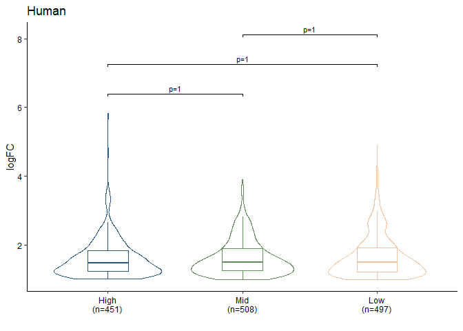

<!-- README.md is generated from README.Rmd. Please edit that file -->

# enRUVseq

<!-- badges: start -->
<!-- badges: end -->

The goal of `enRUVseq` is to perform normalization on RNA-seq including
enrichment (NAD-RNA-seq) using spike-in.

The main functions for normalizing enrichment variation between samples
were inspired by [RUVSeq](https://github.com/drisso/RUVSeq).

## Installation

You can install the development version of enRUVseq from
[GitHub](https://github.com/) with:

``` r
# install.packages("devtools")
devtools::install_github("thereallda/enRUVseq")
```

## Quick tour

``` r
library(enRUVseq)
library(tidyverse)
#> -- Attaching packages --------------------------------------- tidyverse 1.3.0 --
#> v ggplot2 3.3.5     v purrr   0.3.4
#> v tibble  3.0.4     v dplyr   1.0.2
#> v tidyr   1.1.2     v stringr 1.4.0
#> v readr   1.4.0     v forcats 0.5.0
#> Warning: package 'ggplot2' was built under R version 4.0.5
#> -- Conflicts ------------------------------------------ tidyverse_conflicts() --
#> x dplyr::filter() masks stats::filter()
#> x dplyr::lag()    masks stats::lag()
library(edgeR)
#> Loading required package: limma
```

### Load data

Metadata including sample information.

``` r
meta <- read.csv('data-raw/metadata_enRUVg.csv', comment.char = '#')
meta
#>     id   condition replicate
#> 1   G1  High.Input         1
#> 2   G2  High.Input         2
#> 3   G3  High.Input         3
#> 4   G4   Mid.Input         1
#> 5   G5   Mid.Input         2
#> 6   G6   Mid.Input         3
#> 7   G7   Low.Input         1
#> 8   G8   Low.Input         2
#> 9   G9   Low.Input         3
#> 10 G10 High.Enrich         1
#> 11 G11 High.Enrich         2
#> 12 G12 High.Enrich         3
#> 13 G13  Mid.Enrich         1
#> 14 G14  Mid.Enrich         2
#> 15 G15  Mid.Enrich         3
#> 16 G16  Low.Enrich         1
#> 17 G17  Low.Enrich         2
#> 18 G18  Low.Enrich         3
```

NAD-RNA-Sequencing data, with genes in rows and samples in columns.

``` r
counts.df <- read.csv('data-raw/Counts_enRUVg.csv', row.names = 1)
counts.df[1:3,]
#>                 G1 G2 G3 G4 G5 G6 G7 G8 G9 G10 G11 G12 G13 G14 G15 G16 G17 G18
#> ENSG00000223972  0  0  0  0  0  1  0  0  0   0   0   1   0   2   0   0   0   0
#> ENSG00000227232  6 14  3  5  6  3  8  4 11  11   3   2   7   6   1   4   2   1
#> ENSG00000278267  1  0  0  0  1  0  0  0  0   1   0   0   0   0   0   0   0   0
```

### Filtering low-expressed genes

``` r
keep <- filterByExpr(counts.df, group = meta$condition)
counts.keep <- counts.df[keep,]
dim(counts.df); dim(counts.keep)
#> [1] 76290    18
#> [1] 21035    18
```

### Perform RUV normalization

Both RUVg and RUVs return the following:

-   `dataNorm`: the normalized count matrix of shape n x p, where n is
    the number of samples and p is the number of features.

-   `adjustFactor`: the adjusting factor for removing unwanted variation
    (n x k).

-   `alpha`: the nuisance parameters (k x p).

-   RUVg

``` r
spikeInPrefix <- '^FB' # prefix of spike-in gene id
control.idx <- grep(spikeInPrefix, rownames(counts.keep), value = TRUE)
set.ruvg <- normRUV(counts.keep, 
                    control.idx = control.idx,
                    method = 'RUVg')
str(set.ruvg)
#> List of 3
#>  $ dataNorm    : num [1:21035, 1:18] 18.6 253.9 85.8 58.1 21.6 ...
#>   ..- attr(*, "dimnames")=List of 2
#>   .. ..$ : chr [1:21035] "ENSG00000279457" "ENSG00000248527" "ENSG00000188976" "ENSG00000187608" ...
#>   .. ..$ : chr [1:18] "G1" "G2" "G3" "G4" ...
#>  $ adjustFactor: num [1:18, 1] 0.05434 -0.00651 0.06469 -0.04485 -0.05526 ...
#>   ..- attr(*, "dimnames")=List of 2
#>   .. ..$ : NULL
#>   .. ..$ : chr "W_1"
#>  $ alpha       : num [1, 1:21035] -1.1671 -0.0928 0.9526 -0.3312 2.3956 ...
#>   ..- attr(*, "dimnames")=List of 2
#>   .. ..$ : chr "W_1"
#>   .. ..$ : chr [1:21035] "ENSG00000279457" "ENSG00000248527" "ENSG00000188976" "ENSG00000187608" ...
```

-   RUVs

When using `RUVs`, replicated samples needed to be specified with a
matrix `sc.idx`.

`sc.idx` A numeric matrix specifying the replicate samples for which to
compute the count differences used to estimate the factors of unwanted
variation.

``` r
spikeInPrefix <- '^FB' # prefix of spike-in gene id
control.idx <- grep(spikeInPrefix, rownames(counts.keep), value = TRUE)
sc.idx <-  t(sapply(unique(meta$condition), function(i) grep(i, meta$condition)))
sc.idx 
#>             [,1] [,2] [,3]
#> High.Input     1    2    3
#> Mid.Input      4    5    6
#> Low.Input      7    8    9
#> High.Enrich   10   11   12
#> Mid.Enrich    13   14   15
#> Low.Enrich    16   17   18
```

``` r
set.ruvs <- normRUV(counts.keep, 
                    control.idx = control.idx,
                    sc.idx = sc.idx,
                    method = 'RUVs')
str(set.ruvs)
#> List of 3
#>  $ dataNorm    : num [1:21035, 1:18] 12.942 367.195 35.478 76.519 0.376 ...
#>   ..- attr(*, "dimnames")=List of 2
#>   .. ..$ : chr [1:21035] "ENSG00000279457" "ENSG00000248527" "ENSG00000188976" "ENSG00000187608" ...
#>   .. ..$ : chr [1:18] "G1" "G2" "G3" "G4" ...
#>  $ adjustFactor: num [1:18, 1] 1.002 0.998 0.991 0.973 1.007 ...
#>   ..- attr(*, "dimnames")=List of 2
#>   .. ..$ : chr [1:18] "G1" "G2" "G3" "G4" ...
#>   .. ..$ : chr "W_1"
#>  $ alpha       : num [1, 1:21035] 0.43 -0.535 1.3 -0.41 4.16 ...
#>   ..- attr(*, "dimnames")=List of 2
#>   .. ..$ : NULL
#>   .. ..$ : chr [1:21035] "ENSG00000279457" "ENSG00000248527" "ENSG00000188976" "ENSG00000187608" ...
```

### Differential analysis with edgeR

One can use `edgeR` to perform differential analysis with adjusting
factors estimated from RUV.

First, specifying the contrasts

``` r
contrast_df <- data.frame(Group1 = unique(grep("Enrich", meta$condition, value = TRUE)),
                          Group2 = unique(grep("Input", meta$condition, value = TRUE)))
contrast_df
#>        Group1     Group2
#> 1 High.Enrich High.Input
#> 2  Mid.Enrich  Mid.Input
#> 3  Low.Enrich  Low.Input
```

Then, perform `edgeR` procedure with non-spike-in counts

``` r
counts.nsp <- counts.keep[!rownames(counts.keep) %in% control.idx, ]
de.nsp1 <- edgeRDE(counts.nsp, 
            group = meta$condition,
            contrast.df = contrast_df,
            adjust.factors = set.ruvg$adjustFactor) 

str(de.nsp1)
#> List of 3
#>  $ de.obj    :Formal class 'DGEList' [package "edgeR"] with 1 slot
#>   .. ..@ .Data:List of 11
#>   .. .. ..$ : int [1:8028, 1:18] 9 128 45 29 12 102 20 34 22 10 ...
#>   .. .. .. ..- attr(*, "dimnames")=List of 2
#>   .. .. .. .. ..$ : chr [1:8028] "ENSG00000279457" "ENSG00000248527" "ENSG00000188976" "ENSG00000187608" ...
#>   .. .. .. .. ..$ : chr [1:18] "G1" "G2" "G3" "G4" ...
#>   .. .. ..$ :'data.frame':   18 obs. of  3 variables:
#>   .. .. .. ..$ group       : Factor w/ 6 levels "High.Enrich",..: 2 2 2 6 6 6 4 4 4 1 ...
#>   .. .. .. ..$ lib.size    : num [1:18] 460402 478429 454057 483226 455204 ...
#>   .. .. .. ..$ norm.factors: num [1:18] 1.1 1.11 1.11 1.08 1.08 ...
#>   .. .. ..$ : num [1:18, 1:7] 0 0 0 0 0 0 0 0 0 1 ...
#>   .. .. .. ..- attr(*, "dimnames")=List of 2
#>   .. .. .. .. ..$ : chr [1:18] "G1" "G2" "G3" "G4" ...
#>   .. .. .. .. ..$ : chr [1:7] "conditionHigh.Enrich" "conditionHigh.Input" "conditionLow.Enrich" "conditionLow.Input" ...
#>   .. .. .. ..- attr(*, "assign")= int [1:7] 1 1 1 1 1 1 2
#>   .. .. .. ..- attr(*, "contrasts")=List of 1
#>   .. .. .. .. ..$ condition: chr "contr.treatment"
#>   .. .. ..$ : num 0.0265
#>   .. .. ..$ : num [1:8028] 0.1221 0.0118 0.0308 0.0294 0.1059 ...
#>   .. .. ..$ : num [1:8028] 0.125 0.0113 0.0313 0.0312 0.1464 ...
#>   .. .. ..$ : num [1:8028] 4.36 7.97 6.33 6.39 4.56 ...
#>   .. .. ..$ : chr "locfit"
#>   .. .. ..$ : num 63.9
#>   .. .. ..$ : num 5.81
#>   .. .. ..$ : num 0.309
#>  $ res.ls    :List of 3
#>   ..$ High.Enrich-High.Input:'data.frame':   8028 obs. of  6 variables:
#>   .. ..$ GeneID: chr [1:8028] "ENSG00000244734" "Syn1" "ENSG00000227081" "ENSG00000137970" ...
#>   .. ..$ logFC : num [1:8028] 2.62 5.6 2.6 2.45 3.47 ...
#>   .. ..$ logCPM: num [1:8028] 16.38 9.83 12.54 11.44 9.42 ...
#>   .. ..$ LR    : num [1:8028] 977 832 712 447 446 ...
#>   .. ..$ PValue: num [1:8028] 1.54e-214 5.95e-183 5.77e-157 3.68e-99 5.23e-99 ...
#>   .. ..$ FDR   : num [1:8028] 1.23e-210 2.39e-179 1.54e-153 7.39e-96 8.40e-96 ...
#>   ..$ Mid.Enrich-Mid.Input  :'data.frame':   8028 obs. of  6 variables:
#>   .. ..$ GeneID: chr [1:8028] "ENSG00000244734" "Syn1" "ENSG00000227081" "ENSG00000137970" ...
#>   .. ..$ logFC : num [1:8028] 2.76 6.43 2.8 2.68 2.48 ...
#>   .. ..$ logCPM: num [1:8028] 16.38 9.83 12.54 11.44 11.07 ...
#>   .. ..$ LR    : num [1:8028] 1180 1093 911 594 562 ...
#>   .. ..$ PValue: num [1:8028] 1.24e-258 1.29e-239 3.76e-200 4.17e-131 2.54e-124 ...
#>   .. ..$ FDR   : num [1:8028] 9.98e-255 5.19e-236 1.01e-196 8.36e-128 4.08e-121 ...
#>   ..$ Low.Enrich-Low.Input  :'data.frame':   8028 obs. of  6 variables:
#>   .. ..$ GeneID: chr [1:8028] "ENSG00000244734" "Syn1" "ENSG00000227081" "ENSG00000137970" ...
#>   .. ..$ logFC : num [1:8028] 2.73 6.17 2.85 3.01 2.59 ...
#>   .. ..$ logCPM: num [1:8028] 16.38 9.83 12.54 11.44 11.07 ...
#>   .. ..$ LR    : num [1:8028] 1087 1064 878 697 574 ...
#>   .. ..$ PValue: num [1:8028] 2.71e-238 2.54e-233 4.73e-193 1.46e-153 6.56e-127 ...
#>   .. ..$ FDR   : num [1:8028] 2.18e-234 1.02e-229 1.26e-189 2.92e-150 1.05e-123 ...
#>  $ res.sig.ls:List of 3
#>   ..$ High.Enrich-High.Input:'data.frame':   441 obs. of  6 variables:
#>   .. ..$ GeneID: chr [1:441] "ENSG00000244734" "Syn1" "ENSG00000227081" "ENSG00000137970" ...
#>   .. ..$ logFC : num [1:441] 2.62 5.6 2.6 2.45 3.47 ...
#>   .. ..$ logCPM: num [1:441] 16.38 9.83 12.54 11.44 9.42 ...
#>   .. ..$ LR    : num [1:441] 977 832 712 447 446 ...
#>   .. ..$ PValue: num [1:441] 1.54e-214 5.95e-183 5.77e-157 3.68e-99 5.23e-99 ...
#>   .. ..$ FDR   : num [1:441] 1.23e-210 2.39e-179 1.54e-153 7.39e-96 8.40e-96 ...
#>   ..$ Mid.Enrich-Mid.Input  :'data.frame':   519 obs. of  6 variables:
#>   .. ..$ GeneID: chr [1:519] "ENSG00000244734" "Syn1" "ENSG00000227081" "ENSG00000137970" ...
#>   .. ..$ logFC : num [1:519] 2.76 6.43 2.8 2.68 2.48 ...
#>   .. ..$ logCPM: num [1:519] 16.38 9.83 12.54 11.44 11.07 ...
#>   .. ..$ LR    : num [1:519] 1180 1093 911 594 562 ...
#>   .. ..$ PValue: num [1:519] 1.24e-258 1.29e-239 3.76e-200 4.17e-131 2.54e-124 ...
#>   .. ..$ FDR   : num [1:519] 9.98e-255 5.19e-236 1.01e-196 8.36e-128 4.08e-121 ...
#>   ..$ Low.Enrich-Low.Input  :'data.frame':   452 obs. of  6 variables:
#>   .. ..$ GeneID: chr [1:452] "ENSG00000244734" "Syn1" "ENSG00000227081" "ENSG00000137970" ...
#>   .. ..$ logFC : num [1:452] 2.73 6.17 2.85 3.01 2.59 ...
#>   .. ..$ logCPM: num [1:452] 16.38 9.83 12.54 11.44 11.07 ...
#>   .. ..$ LR    : num [1:452] 1087 1064 878 697 574 ...
#>   .. ..$ PValue: num [1:452] 2.71e-238 2.54e-233 4.73e-193 1.46e-153 6.56e-127 ...
#>   .. ..$ FDR   : num [1:452] 2.18e-234 1.02e-229 1.26e-189 2.92e-150 1.05e-123 ...
```

`edgeRDE` return a list of differential analysis objects, including: -
`de.obj`: differential analysis object - `res.ls`: list of differential
analysis unfiltered-results tables - `res.sig.ls`: list of filtered
results tables, default `logFC >= 1 & FDR < 0.05`

Similarly, one can perform with adjusting factors from RUVs

``` r
de.nsp2 <- edgeRDE(counts.nsp, 
            group = meta$condition,
            contrast.df = contrast_df,
            adjust.factors = set.ruvs$adjustFactor) 

str(de.nsp2)
#> List of 3
#>  $ de.obj    :Formal class 'DGEList' [package "edgeR"] with 1 slot
#>   .. ..@ .Data:List of 11
#>   .. .. ..$ : int [1:8028, 1:18] 9 128 45 29 12 102 20 34 22 10 ...
#>   .. .. .. ..- attr(*, "dimnames")=List of 2
#>   .. .. .. .. ..$ : chr [1:8028] "ENSG00000279457" "ENSG00000248527" "ENSG00000188976" "ENSG00000187608" ...
#>   .. .. .. .. ..$ : chr [1:18] "G1" "G2" "G3" "G4" ...
#>   .. .. ..$ :'data.frame':   18 obs. of  3 variables:
#>   .. .. .. ..$ group       : Factor w/ 6 levels "High.Enrich",..: 2 2 2 6 6 6 4 4 4 1 ...
#>   .. .. .. ..$ lib.size    : num [1:18] 460402 478429 454057 483226 455204 ...
#>   .. .. .. ..$ norm.factors: num [1:18] 1.1 1.11 1.11 1.08 1.08 ...
#>   .. .. ..$ : num [1:18, 1:7] 0 0 0 0 0 0 0 0 0 1 ...
#>   .. .. .. ..- attr(*, "dimnames")=List of 2
#>   .. .. .. .. ..$ : chr [1:18] "G1" "G2" "G3" "G4" ...
#>   .. .. .. .. ..$ : chr [1:7] "conditionHigh.Enrich" "conditionHigh.Input" "conditionLow.Enrich" "conditionLow.Input" ...
#>   .. .. .. ..- attr(*, "assign")= int [1:7] 1 1 1 1 1 1 2
#>   .. .. .. ..- attr(*, "contrasts")=List of 1
#>   .. .. .. .. ..$ condition: chr "contr.treatment"
#>   .. .. ..$ : num 0.0256
#>   .. .. ..$ : num [1:8028] 0.1193 0.0116 0.0296 0.0283 0.1032 ...
#>   .. .. ..$ : num [1:8028] 0.1193 0.0103 0.0295 0.0299 0.0945 ...
#>   .. .. ..$ : num [1:8028] 4.36 7.97 6.33 6.39 4.56 ...
#>   .. .. ..$ : chr "locfit"
#>   .. .. ..$ : num 59.6
#>   .. .. ..$ : num 5.42
#>   .. .. ..$ : num 0.309
#>  $ res.ls    :List of 3
#>   ..$ High.Enrich-High.Input:'data.frame':   8028 obs. of  6 variables:
#>   .. ..$ GeneID: chr [1:8028] "Syn1" "ENSG00000244734" "ENSG00000227081" "ENSG00000137970" ...
#>   .. ..$ logFC : num [1:8028] 5.67 2.38 2.36 2.57 3.03 ...
#>   .. ..$ logCPM: num [1:8028] 9.83 16.38 12.54 11.43 9.13 ...
#>   .. ..$ LR    : num [1:8028] 661 374 341 303 277 ...
#>   .. ..$ PValue: num [1:8028] 9.34e-146 2.36e-83 3.88e-76 6.74e-68 3.57e-62 ...
#>   .. ..$ FDR   : num [1:8028] 7.50e-142 9.46e-80 1.04e-72 1.35e-64 5.73e-59 ...
#>   ..$ Mid.Enrich-Mid.Input  :'data.frame':   8028 obs. of  6 variables:
#>   .. ..$ GeneID: chr [1:8028] "Syn1" "ENSG00000244734" "ENSG00000227081" "ENSG00000137970" ...
#>   .. ..$ logFC : num [1:8028] 6.51 2.56 2.6 2.78 2.27 ...
#>   .. ..$ logCPM: num [1:8028] 9.83 16.38 12.54 11.43 11.07 ...
#>   .. ..$ LR    : num [1:8028] 744 387 370 321 266 ...
#>   .. ..$ PValue: num [1:8028] 6.73e-164 3.37e-86 1.78e-82 1.10e-71 9.23e-60 ...
#>   .. ..$ FDR   : num [1:8028] 5.40e-160 1.35e-82 4.77e-79 2.21e-68 1.48e-56 ...
#>   ..$ Low.Enrich-Low.Input  :'data.frame':   8028 obs. of  6 variables:
#>   .. ..$ GeneID: chr [1:8028] "Syn1" "ENSG00000244734" "ENSG00000227081" "ENSG00000137970" ...
#>   .. ..$ logFC : num [1:8028] 6.21 2.72 2.81 3 2.48 ...
#>   .. ..$ logCPM: num [1:8028] 9.83 16.38 12.54 11.43 11.07 ...
#>   .. ..$ LR    : num [1:8028] 783 465 454 388 314 ...
#>   .. ..$ PValue: num [1:8028] 2.20e-172 3.41e-103 8.47e-101 1.97e-86 2.54e-70 ...
#>   .. ..$ FDR   : num [1:8028] 1.77e-168 1.37e-99 2.27e-97 3.96e-83 4.08e-67 ...
#>  $ res.sig.ls:List of 3
#>   ..$ High.Enrich-High.Input:'data.frame':   379 obs. of  6 variables:
#>   .. ..$ GeneID: chr [1:379] "Syn1" "ENSG00000244734" "ENSG00000227081" "ENSG00000137970" ...
#>   .. ..$ logFC : num [1:379] 5.67 2.38 2.36 2.57 3.03 ...
#>   .. ..$ logCPM: num [1:379] 9.83 16.38 12.54 11.43 9.13 ...
#>   .. ..$ LR    : num [1:379] 661 374 341 303 277 ...
#>   .. ..$ PValue: num [1:379] 9.34e-146 2.36e-83 3.88e-76 6.74e-68 3.57e-62 ...
#>   .. ..$ FDR   : num [1:379] 7.50e-142 9.46e-80 1.04e-72 1.35e-64 5.73e-59 ...
#>   ..$ Mid.Enrich-Mid.Input  :'data.frame':   425 obs. of  6 variables:
#>   .. ..$ GeneID: chr [1:425] "Syn1" "ENSG00000244734" "ENSG00000227081" "ENSG00000137970" ...
#>   .. ..$ logFC : num [1:425] 6.51 2.56 2.6 2.78 2.27 ...
#>   .. ..$ logCPM: num [1:425] 9.83 16.38 12.54 11.43 11.07 ...
#>   .. ..$ LR    : num [1:425] 744 387 370 321 266 ...
#>   .. ..$ PValue: num [1:425] 6.73e-164 3.37e-86 1.78e-82 1.10e-71 9.23e-60 ...
#>   .. ..$ FDR   : num [1:425] 5.40e-160 1.35e-82 4.77e-79 2.21e-68 1.48e-56 ...
#>   ..$ Low.Enrich-Low.Input  :'data.frame':   443 obs. of  6 variables:
#>   .. ..$ GeneID: chr [1:443] "Syn1" "ENSG00000244734" "ENSG00000227081" "ENSG00000137970" ...
#>   .. ..$ logFC : num [1:443] 6.21 2.72 2.81 3 2.48 ...
#>   .. ..$ logCPM: num [1:443] 9.83 16.38 12.54 11.43 11.07 ...
#>   .. ..$ LR    : num [1:443] 783 465 454 388 314 ...
#>   .. ..$ PValue: num [1:443] 2.20e-172 3.41e-103 8.47e-101 1.97e-86 2.54e-70 ...
#>   .. ..$ FDR   : num [1:443] 1.77e-168 1.37e-99 2.27e-97 3.96e-83 4.08e-67 ...
```

### Visualization

PCA before and after normalization

``` r
library(patchwork)
samples_name <- paste(meta$condition, meta$replicate, sep = '.')
# raw counts
p1 <- ggPCA(log2(counts.nsp + 1), labels = samples_name, vst.norm = FALSE) + ggtitle('Raw')
# RUV normalized counts
counts.nsp.ruv <- set.ruvg$dataNorm[!rownames(set.ruvg$dataNorm) %in% control.idx,]
p2 <- ggPCA(log2(counts.nsp.ruv + 1), labels = samples_name, vst.norm = FALSE) + ggtitle('RUV')

p1 + p2
```


The global difference of fold-change of significant DEGs

``` r
# reduce a list of DE tables into one data frame
df.nsp <- reduceRes(de.nsp1$res.sig.ls, fc.col = 'logFC') # fc.col specify the name of log-fold change column
head(df.nsp)
#>   GeneID    logFC                  Group
#> 1      1 2.624949 High.Enrich-High.Input
#> 2      2 5.596259 High.Enrich-High.Input
#> 3      3 2.603689 High.Enrich-High.Input
#> 4      4 2.446061 High.Enrich-High.Input
#> 5      5 3.469695 High.Enrich-High.Input
#> 6      6 2.291440 High.Enrich-High.Input
```

``` r
# Simplify group name
df.nsp$Group <- gsub('\\..*', '', df.nsp$Group)
df.nsp$Group <- factor(df.nsp$Group, levels = unique(df.nsp$Group))
# visualization with box vilion plot
BetweenStatPlot(df.nsp, 
                x = 'Group',
                y = 'logFC',
                color = 'Group')
```


