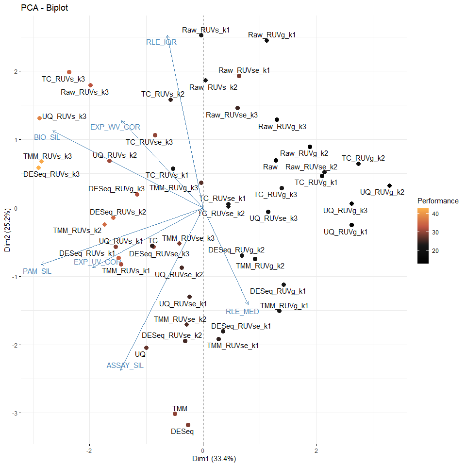

<!-- README.md is generated from README.Rmd. Please edit that file -->

# enRUVseq

<!-- badges: start -->
<!-- badges: end -->

The goal of `enRUVseq` is to perform normalization on RNA-seq including
enrichment (NAD-RNA-seq) using spike-in.

The main functions for normalizing enrichment variation between samples
were inspired by [RUVSeq](https://github.com/drisso/RUVSeq).

## Installation

You can install the development version of enRUVseq from
[GitHub](https://github.com/) with:

``` r
# install.packages("devtools")
devtools::install_github("thereallda/enRUVseq")
```

## Workflow

``` r
library(enRUVseq)
library(tidyverse)
library(edgeR)
library(paintingr)
library(patchwork)
library(SummarizedExperiment)
```

### Load data

Metadata including sample information.

``` r
meta <- read.csv('data-raw/metadata.csv', comment.char = '#')
meta
#>     id   condition replicate
#> 1   G1  High.Input         1
#> 2   G2  High.Input         2
#> 3   G3  High.Input         3
#> 4   G4   Mid.Input         1
#> 5   G5   Mid.Input         2
#> 6   G6   Mid.Input         3
#> 7   G7   Low.Input         1
#> 8   G8   Low.Input         2
#> 9   G9   Low.Input         3
#> 10 G10 High.Enrich         1
#> 11 G11 High.Enrich         2
#> 12 G12 High.Enrich         3
#> 13 G13  Mid.Enrich         1
#> 14 G14  Mid.Enrich         2
#> 15 G15  Mid.Enrich         3
#> 16 G16  Low.Enrich         1
#> 17 G17  Low.Enrich         2
#> 18 G18  Low.Enrich         3
```

NAD-RNA-Sequencing data, with genes in rows and samples in columns.

``` r
counts.df <- read.csv('data-raw/Counts.csv', row.names = 1)
counts.df[1:3,]
#>                 G1 G2 G3 G4 G5 G6 G7 G8 G9 G10 G11 G12 G13 G14 G15 G16 G17 G18
#> ENSG00000223972  0  0  0  0  0  1  0  0  0   0   0   1   0   2   0   0   0   0
#> ENSG00000227232  6 14  3  5  6  3  8  4 11  11   3   2   7   6   1   4   2   1
#> ENSG00000278267  1  0  0  0  1  0  0  0  0   1   0   0   0   0   0   0   0   0
```

### Filtering low-expressed genes

``` r
spikeInPrefix <- '^FB'
keep <- filterByExpr(counts.df, group = meta$condition)
counts_keep <- counts.df[keep,]
dim(counts.df); dim(counts_keep)
#> [1] 76290    18
#> [1] 21035    18
```

### Create Enone object

Use “input.id” and “enrich.id” to specify the id of input and enrich
library, which should be the same as `group`. If `group` is
`c("High.Input", "High.Enrich",...)`, then `input.id` = ‘Input’ and
`enrich.id` = ‘Enrich’.

`synthetic.id` is a vector specify the ids of synthetic RNA, if
included.

``` r
enrich_group <- gsub(".*\\.", "", meta$condition)

Enone <- createEnone(data = counts_keep,
                     bio.group = meta$condition,
                     enrich.group = enrich_group,
                     batch.group = NULL,
                     spike.in.prefix = spikeInPrefix,
                     synthetic.id = c('Syn1','Syn2'),
                     input.id = "Input",
                     enrich.id = "Enrich"
                     )
Enone
#> class: Enone 
#> dim: 21035 18 
#> metadata(0):
#> assays(1): ''
#> rownames(21035): ENSG00000279457 ENSG00000248527 ... Syn1 Syn2
#> rowData names(3): GeneID SpikeIn Synthetic
#> colnames(18): G1 G2 ... G17 G18
#> colData names(5): id condition enrich replicate batch
```

Raw counts (sample + spike-in) can be accessed with

``` r
assay(Enone)[1:3,];dim(assay(Enone))
#>                  G1  G2  G3  G4 G5 G6 G7  G8  G9 G10 G11 G12 G13 G14 G15 G16
#> ENSG00000279457   9  16   9   6  9  8  7  17   8   1   1   9   2   6   6   7
#> ENSG00000248527 128 103 101 126 98 94 86 139 132 130 106 121 101 110 102  69
#> ENSG00000188976  45  58  40  35 45 42 27  49  38  29  22  20  32  28  35  19
#>                 G17 G18
#> ENSG00000279457   3   4
#> ENSG00000248527  71 102
#> ENSG00000188976  34   6
#> [1] 21035    18
```

Sample information is stored in `colData`

``` r
colData(Enone)
#> DataFrame with 18 rows and 5 columns
#>              id   condition      enrich replicate       batch
#>     <character> <character> <character> <numeric> <character>
#> G1           G1  High.Input       Input         1          NA
#> G2           G2  High.Input       Input         2          NA
#> G3           G3  High.Input       Input         3          NA
#> G4           G4   Mid.Input       Input         1          NA
#> G5           G5   Mid.Input       Input         2          NA
#> ...         ...         ...         ...       ...         ...
#> G14         G14  Mid.Enrich      Enrich         2          NA
#> G15         G15  Mid.Enrich      Enrich         3          NA
#> G16         G16  Low.Enrich      Enrich         1          NA
#> G17         G17  Low.Enrich      Enrich         2          NA
#> G18         G18  Low.Enrich      Enrich         3          NA
```

### Perform normalization and assessment

Normalization and assessment can be achieved by wrapper function `enONE`

``` r
Enone <- enONE(Enone, 
               ruv.norm = TRUE, ruv.k = 3,
               pam_krange = 2:6, pc_k = 3
               )
#> The number of negative control genes for RUV: 1000 
#> The number of positive evaluation genes: 1000 
#> The number of negative evaluation genes: 1000 
#> Apply normalization...
#> Perform assessment...
```

Normalized counts are stored in `counts` slot in which `sample` slot
holds the counts from sample and `spike_in` slot for spike-in counts.

``` r
names(Enone@counts$sample)
#>  [1] "TC"             "UQ"             "TMM"            "DESeq"         
#>  [5] "Raw"            "TC_RUVg_k1"     "TC_RUVs_k1"     "TC_RUVse_k1"   
#>  [9] "TC_RUVg_k2"     "TC_RUVs_k2"     "TC_RUVse_k2"    "TC_RUVg_k3"    
#> [13] "TC_RUVs_k3"     "TC_RUVse_k3"    "UQ_RUVg_k1"     "UQ_RUVs_k1"    
#> [17] "UQ_RUVse_k1"    "UQ_RUVg_k2"     "UQ_RUVs_k2"     "UQ_RUVse_k2"   
#> [21] "UQ_RUVg_k3"     "UQ_RUVs_k3"     "UQ_RUVse_k3"    "TMM_RUVg_k1"   
#> [25] "TMM_RUVs_k1"    "TMM_RUVse_k1"   "TMM_RUVg_k2"    "TMM_RUVs_k2"   
#> [29] "TMM_RUVse_k2"   "TMM_RUVg_k3"    "TMM_RUVs_k3"    "TMM_RUVse_k3"  
#> [33] "DESeq_RUVg_k1"  "DESeq_RUVs_k1"  "DESeq_RUVse_k1" "DESeq_RUVg_k2" 
#> [37] "DESeq_RUVs_k2"  "DESeq_RUVse_k2" "DESeq_RUVg_k3"  "DESeq_RUVs_k3" 
#> [41] "DESeq_RUVse_k3" "Raw_RUVg_k1"    "Raw_RUVs_k1"    "Raw_RUVse_k1"  
#> [45] "Raw_RUVg_k2"    "Raw_RUVs_k2"    "Raw_RUVse_k2"   "Raw_RUVg_k3"   
#> [49] "Raw_RUVs_k3"    "Raw_RUVse_k3"
```

Check the performance of normalization

``` r
Enone@enone_score
#>                BIO_SIL ASSAY_SIL BATCH_SIL PAM_SIL RLE_MED RLE_IQR EXP_WV_COR
#> DESeq_RUVs_k3       47        27         1      50      37      45         45
#> TMM_RUVs_k3         48        26         1      49      34      44         44
#> UQ_RUVs_k3          49        22         1      48      14      46         39
#> TMM_RUVs_k2         46        24         1      45      39      34         16
#> DESeq_RUVs_k2       45        19         1      44      42      33         18
#> TC_RUVs_k3          50        25         1      47       8      47         47
#> DESeq_RUVs_k1       40        30         1      38      40      17         36
#> Raw_RUVs_k3         42        15         1      46      10      43         43
#> DESeq_RUVg_k3       33        34         1      26      23      30         41
#> TMM_RUVs_k1         39        32         1      37      28      14         29
#> UQ_RUVs_k2          44        18         1      40      16      36         19
#> TC_RUVse_k3         35        38         1      24      15      41         42
#> DESeq_RUVse_k3      25        37         1      23      22      22         35
#> TMM                 20        49         1      42      47       4         11
#> UQ_RUVs_k1          34        35         1      36      13      16         31
#> DESeq               19        48         1      41      50       2          8
#> TMM_RUVse_k3        18        36         1      19      24      27         32
#> Raw_RUVse_k1        37        11         1      11      44      49         37
#> UQ                  17        50         1      43      18       3         30
#> TMM_RUVg_k3         26        23         1      18      26      25         38
#> TMM_RUVse_k2        23        45         1      33      27      20          3
#> UQ_RUVse_k2         32        39         1      28      21      26          2
#> UQ_RUVse_k1         16        44         1      27      20       9         34
#> DESeq_RUVse_k2      24        46         1      32      25      13          4
#> Raw_RUVse_k3        36        10         1      22      35      50         10
#> TC_RUVs_k2          43        17         1      34       9      39         21
#> TMM_RUVse_k1        10        43         1      30      31       7         24
#> TC                  27        47         1      39       3       5         46
#> DESeq_RUVse_k1       9        42         1      31      29       6         26
#> TC_RUVg_k3          28         8         1       6      49      23         23
#> Raw_RUVs_k1         38        13         1      14       4      37         48
#> Raw_RUVs_k2         41        14         1      21      11      42         20
#> TC_RUVse_k2         22        40         1      29      17      40          6
#> TMM_RUVg_k1          7        33         1      20      45      10         25
#> DESeq_RUVg_k1       11        29         1      17      46      11         28
#> TC_RUVse_k1         12        41         1      25      12      24         40
#> DESeq_RUVg_k2       30        31         1      15      30      19          7
#> TC_RUVs_k1          31        20         1      35       2      15         33
#> UQ_RUVse_k3          3        28         1      16      19      31         22
#> TMM_RUVg_k2         29        21         1      13      32       8         12
#> Raw_RUVse_k2         4        12         1      12      41      48          5
#> Raw_RUVg_k1         14         4         1       3       5      38         49
#> TC_RUVg_k2           6         5         1       7      48      35         17
#> TC_RUVg_k1          15         7         1       5      36      18         27
#> Raw_RUVg_k3         21         1         1       1       7      28         14
#> UQ_RUVg_k3           2         6         1       4      33      21         13
#> UQ_RUVg_k1           8         9         1       8      38      12         15
#> Raw                 13        16         1      10       1       1         50
#> Raw_RUVg_k2          5         2         1       2       6      29          9
#> UQ_RUVg_k2           1         3         1       9      43      32          1
#>                EXP_UV_COR    SCORE
#> DESeq_RUVs_k3          50 43.00000
#> TMM_RUVs_k3            49 42.00000
#> UQ_RUVs_k3             48 38.00000
#> TMM_RUVs_k2            44 35.42857
#> DESeq_RUVs_k2          45 35.14286
#> TC_RUVs_k3             18 34.57143
#> DESeq_RUVs_k1          40 34.42857
#> Raw_RUVs_k3            29 32.57143
#> DESeq_RUVg_k3          37 32.00000
#> TMM_RUVs_k1            41 31.42857
#> UQ_RUVs_k2             43 30.85714
#> TC_RUVse_k3            15 30.00000
#> DESeq_RUVse_k3         46 30.00000
#> TMM                    36 29.85714
#> UQ_RUVs_k1             42 29.57143
#> DESeq                  35 29.00000
#> TMM_RUVse_k3           47 29.00000
#> Raw_RUVse_k1           10 28.42857
#> UQ                     31 27.42857
#> TMM_RUVg_k3            30 26.57143
#> TMM_RUVse_k2           33 26.28571
#> UQ_RUVse_k2            32 25.71429
#> UQ_RUVse_k1            28 25.42857
#> DESeq_RUVse_k2         34 25.42857
#> Raw_RUVse_k3           13 25.14286
#> TC_RUVs_k2              9 24.57143
#> TMM_RUVse_k1           26 24.42857
#> TC                      3 24.28571
#> DESeq_RUVse_k1         22 23.57143
#> TC_RUVg_k3             25 23.14286
#> Raw_RUVs_k1             7 23.00000
#> Raw_RUVs_k2            11 22.85714
#> TC_RUVse_k2             4 22.57143
#> TMM_RUVg_k1            17 22.42857
#> DESeq_RUVg_k1          14 22.28571
#> TC_RUVse_k1             1 22.14286
#> DESeq_RUVg_k2          23 22.14286
#> TC_RUVs_k1             16 21.71429
#> UQ_RUVse_k3            24 20.42857
#> TMM_RUVg_k2            27 20.28571
#> Raw_RUVse_k2           20 20.28571
#> Raw_RUVg_k1            19 18.85714
#> TC_RUVg_k2              6 17.71429
#> TC_RUVg_k1             12 17.14286
#> Raw_RUVg_k3            38 15.71429
#> UQ_RUVg_k3             21 14.28571
#> UQ_RUVg_k1              8 14.00000
#> Raw                     5 13.71429
#> Raw_RUVg_k2            39 13.14286
#> UQ_RUVg_k2              2 13.00000
```

PCA biplot

if batch not provided, preclude `BATCH_SIL` column

``` r
pca.nsp.eval <- prcomp(Enone@enone_score[,-c(3, 9)], scale = TRUE)
ggPCA_Biplot(pca.nsp.eval, performance_score = Enone@enone_score$SCORE)
```


save

``` r
save(Enone, file='data/NormAssess.rda')
```

### The best performance

``` r
# select the best normalization
best.norm <- rownames(Enone@enone_score[1,])
best.norm.data <- Counts(Enone, slot = 'sample', method = best.norm)
best.norm.factors <- getFactor(Enone, slot = 'sample', method = best.norm)
best.norm
#> [1] "DESeq_RUVs_k3"
```

### Effect of normalization

we use PCA to visualize the counts from non-spike-in samples before and
after the normalization.

``` r
counts_nsp <- counts_keep[grep(spikeInPrefix, rownames(counts_keep), invert = TRUE), ]
samples_name <- paste(meta$condition, meta$replicate, sep='.')
p1 <- ggPCA(log1p(counts_nsp), 
            group = meta$condition,
            label = samples_name, vst.norm = FALSE) + ggtitle('Before normalization')
p2 <- ggPCA(log1p(best.norm.data), 
            group = meta$condition,
            label = samples_name, vst.norm = FALSE) + ggtitle('After normalization')
p1 + p2
```


### FindEnrichment

You can find enriched genes by `FindEnrichment`.

Enriched genes are saved at slots `Enone@enrichment` (all) and
`Enone@enrichment_filtered` (filtered).

Default criteria for enriched genes is log2-Fold-Change \>= 1 & adjusted
p-value \< 0.05.

``` r
Enone <- FindEnrichment(Enone, slot='sample', method = best.norm, 
                        fc.cutoff = 1, p.cutoff = 0.05)
unlist(lapply(Enone@enrichment_filtered$sample, nrow))
#> High.Enrich_High.Input   Mid.Enrich_Mid.Input   Low.Enrich_Low.Input 
#>                    451                    508                    497
```

Each enrichment table is a `data.frame` with a list of genes as rows,
and associated information as columns (GeneID, logFC, p-values, etc.).
The following columns are present in the table:

-   `GeneID`: ID of genes.
-   `logFC`: log2 fold-change between enrichment and input samples.
    Positive values indicate that the gene is more highly enriched in
    the enrichment group.
-   `logCPM`: log2 CPM (counts per million) of the average expression of
    all samples.
-   `LR`: Likelihood ratio of the likelihood ratio test.
-   `PValue`: p-value from the likelihood ratio test.
-   `FDR`: False discovery rate of the p-value, default “BH” method is
    applied.

``` r
head(Enone@enrichment_filtered$sample$High.Enrich_High.Input)
#>            GeneID    logFC    logCPM       LR        PValue           FDR
#> 1 ENSG00000244734 2.504240 16.378929 836.4558 6.399167e-184 5.135971e-180
#> 2 ENSG00000227081 2.497956 12.539401 744.2740 7.054158e-164 2.830833e-160
#> 3 ENSG00000137970 2.513253 11.435113 549.5516 1.575948e-121 4.216187e-118
#> 4 ENSG00000143110 3.329794  9.414213 484.5926 2.139981e-107 4.293871e-104
#> 5 ENSG00000244398 2.218602 11.070572 460.1227 4.520646e-102  7.256541e-99
#> 6 ENSG00000113387 3.057590  9.120418 446.5336  4.097381e-99  5.480930e-96
```

Reduce list of enrichment and visualize with violin-box plot.

``` r
nad.sig.ls <- Enone@enrichment_filtered$sample
nad_df1 <- reduceRes(nad.sig.ls, fc.col = 'logFC')
nad_df1$Group <- gsub('\\..*', '', nad_df1$Group)
nad_df1$Group <- factor(nad_df1$Group, levels = unique(nad_df1$Group))
bxp1 <- BetweenStatPlot(nad_df1, x='Group', y='logFC', color='Group', step.increase = 0.6) + ggtitle('Human')
bxp1
```


